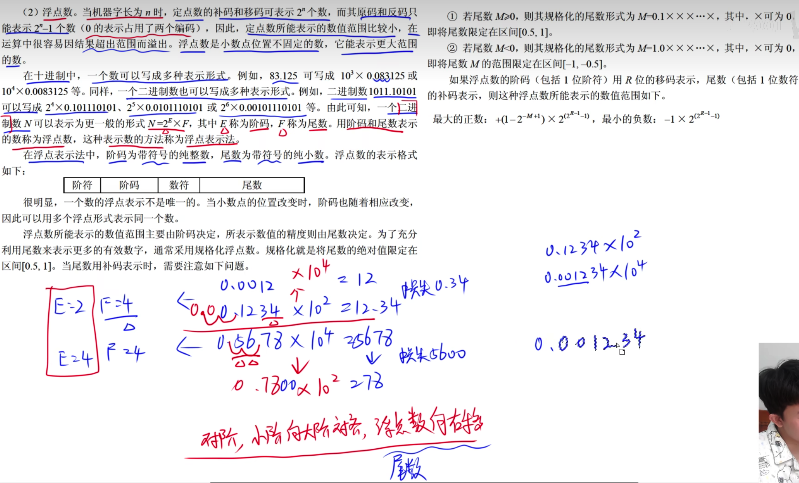
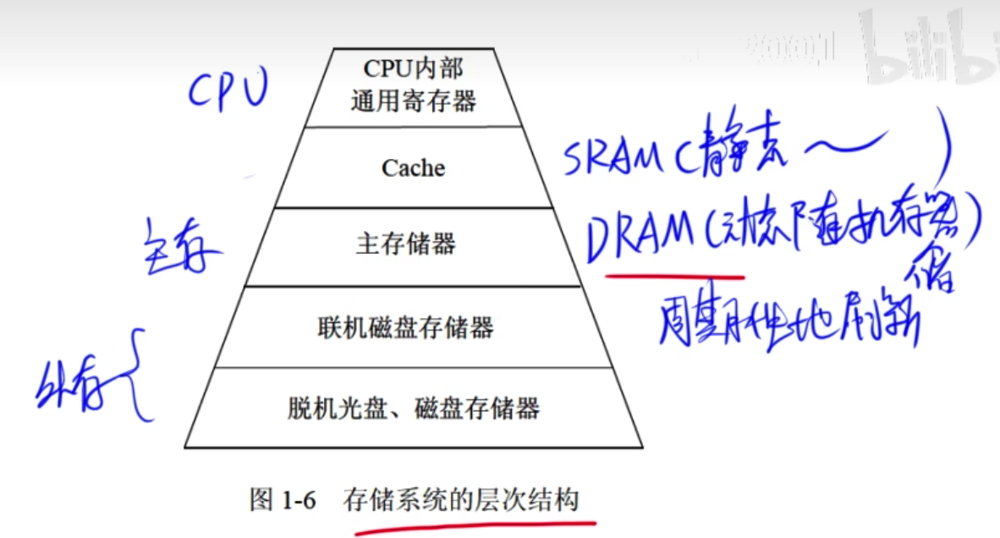

# 浮点数标识

## 原码补码反码

### 原码

原码 = 最高位 + 低位

最高位:是符号位，0正数1负数
低位:数值

十进制7使用二进制原码表示:
00000111
十进制-7使用二进制原码表示:
10000111

### 反码

如果是正数: 反码 = 原码
如果是负数: 除了最高位，其余数值位取反

-7的反码: 11111000

### 补码

如果是正数: 补码 = 原码

如果是负数: 补码 = 反码 + 1

-7的补码: 11111001

如果是正数: 原码 = 反码 = 补码

### 移码

不管是正数还是负数，其移码 = 补码的符号位取反

## 进制

二进制(B)、八进制(O)、十进制(D)、十六进制(H)
二进制使用: 0、1表示
八进制使用: 0、1、2、3、4、5、6、7表示
十进制使用: 0、1、2、3、4、5、6、7、8、9表示
十六进制使用: 0、1、2、3、4、5、6、7、8、9、A、B、C、D、E、F表示

## 内存

1KB = 2^10B = 1024B

1B(字节) = 8bit(位)

## 带宽计算

带宽 = 数据总量 / 总时间

总时间 = 时钟周期 * 个数

时钟周期 = 1 / 始终频率

时钟频率 * 时钟周期 = 

带宽 = 时钟频率 * 每个周期传送的容量
需要注意单位换算

200M * 32bit/5 = 1280Mbit/s

## 判断两数相加是否产生溢出

判断的依据两数相加，结果的符号位是"01"或"10"，则发生了溢出

变形补码判断
正数时，在符号位前面添加两个00、负数时，在符号位前面加11
e.g.: x = +1100 y = + 1000
[x]补 = 001100 [y]补 = 001000

    001100
+   001000
   ————————
    010100
出现了01则产生了溢出。   

# 控制器

# 进制的加减法

每一片的范围(16进制表示):

计算每一片大小范围:

# 原码、反码、补码、移码表示范围

# 规格化浮点数

尾数: 小数部分的位数

如: 0.123 尾数 = 3

R: 阶码 + 1个阶符
M: 尾数 + 1个位符

---

---

题目

---

答案

---

# 寻址

# 奇偶校验码

# 海明码

# 循环冗余校验码

# RISC(精简指令)和CISC(复杂指令)

# 流水线概念

# 存储器

# cache

# 中断

# 输入输出(I/O)控制方式

# 总线

# 摘要与数字签名

# 杂题

溢出时符号位为 01 或者 10 
异或结果都是1

入侵检测和流量控制属于网络安全措施

