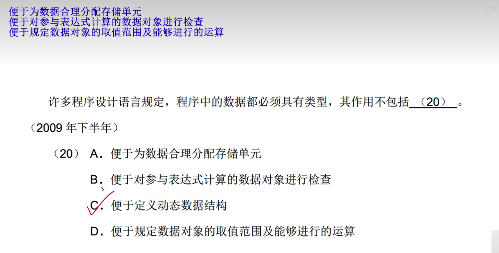
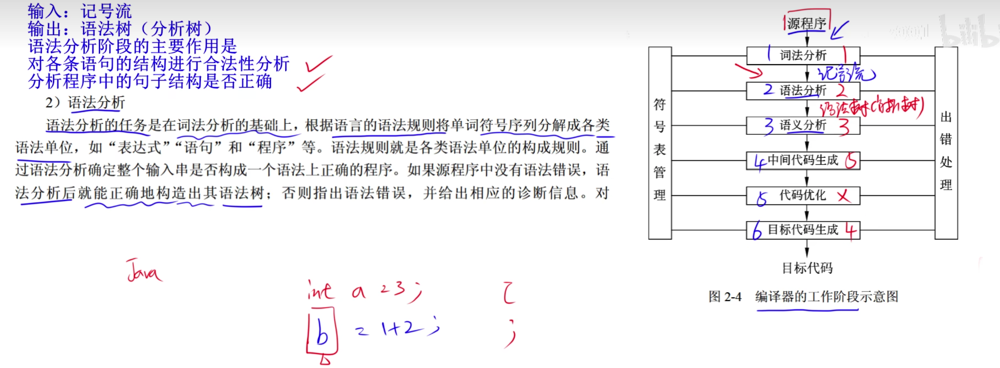
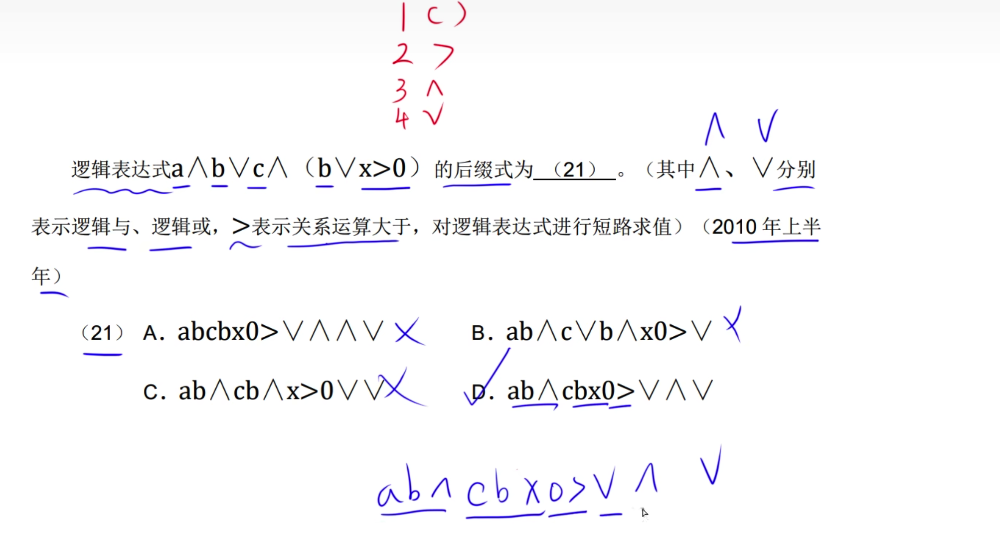

# 编译程序和解释程序

---

---

---

# 程序设计语言基本成分

# 传值调用与传地址调用

形参: add(int a,int b) a、b是形参
实参:add(4,5) 4、5是实参
方法中定义局部变量，局部变量

# 编译、解释程序、翻译阶段

# 符号表

# 词法分析

# 语法分析

int[] a = {1,2;  语法分析这条语句结构错误

# 语义分析

# 目标代码生成

int a = "123"; 语法没有问题，语义有问题

动态语义错误:死循环、1/0;

# 中间代码生成

# 正规式

# 有限自动机

是分析词法有效工具。

初态、终态、转移、合法性、空识别

表示含义:A识别到0转移到A,A识别到1转移到B。
空识别: 可以直接转移。
q0识别到a或者b转移到q1。

转移的状态不确定:
    S0识别到1后，可以转移到S0，也可以转移到S1。

解答正规式的题技巧:
使用先分析转换图，任意一个途径，
使用排除法对正规式进行分析，如果不满足途径则说明，该选项错误。
即正规式包含所有转换图场景。

# 上下无关文法

---

S->A0 A->1 因此S-> 1或者0 

---

解答技巧: 按照选项中的符号，选择推出的结果。

# 中缀式、后缀式转化

# 语法树，中、后续表达式

中缀式->后缀式
    1. 优先级相同的先转化右边的
    2. 转化后把转化的结果作为一个整体

逻辑表达式的优先级
(): 括号
＞: 运算大于
Λ: 逻辑与
V: 逻辑或

转化为后缀式优先级，运算符号，优先级相同的右边优先

后缀式->中缀式:
    1. 从后缀式左边开始转化
    2. 符号前面两个类型的数据转化
    3. 注意括号

脚本语言都是动态语言，动态语言都是解释性语言
如 javascript、php、python

