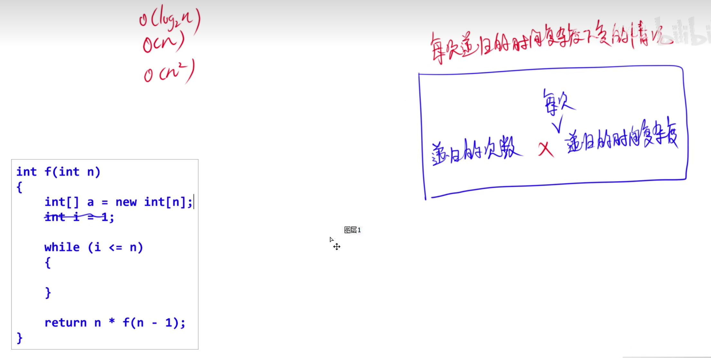
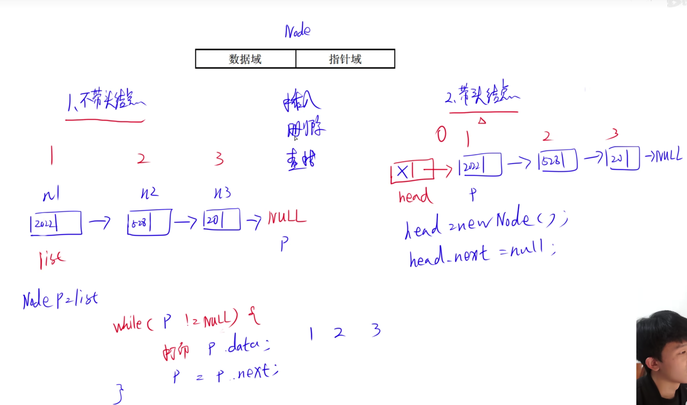
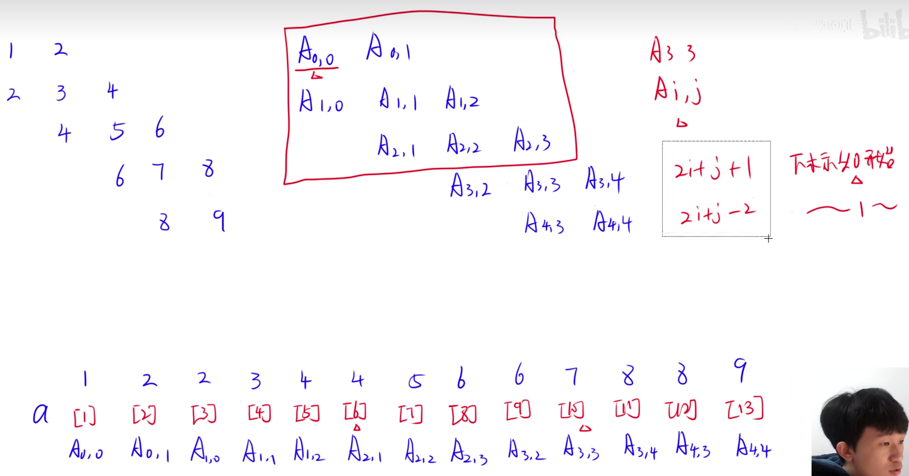
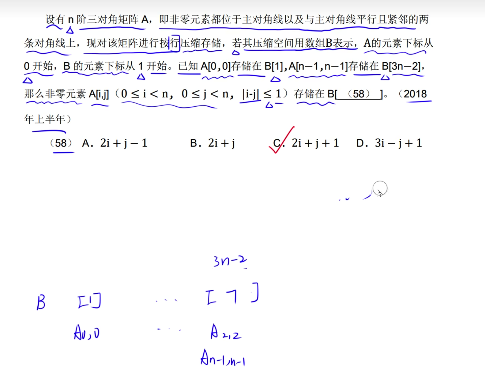
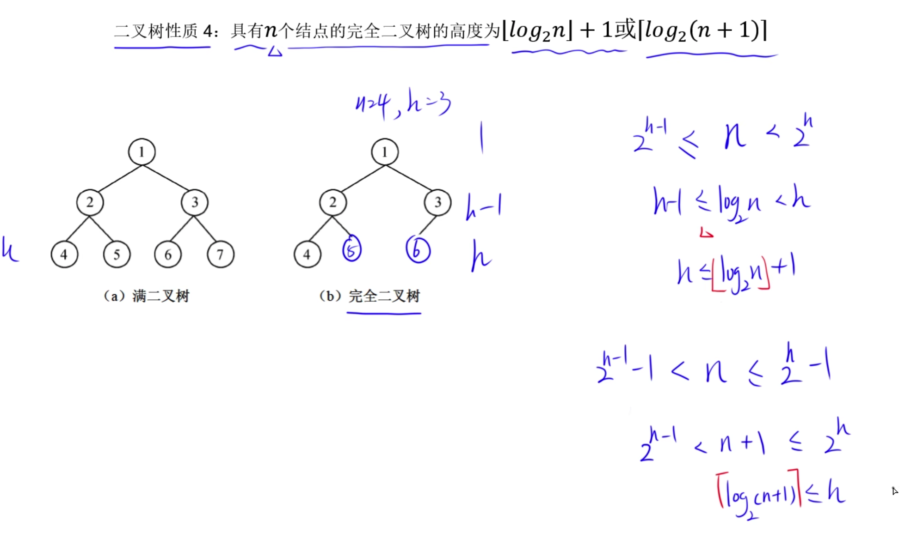
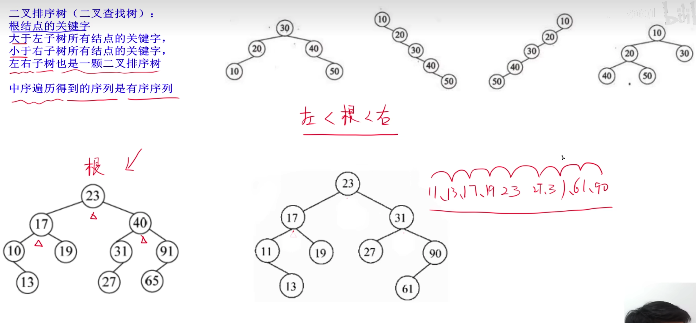
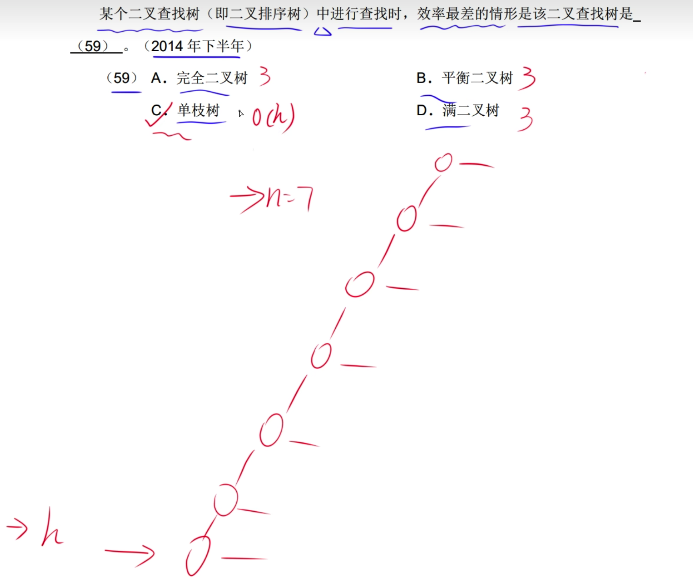
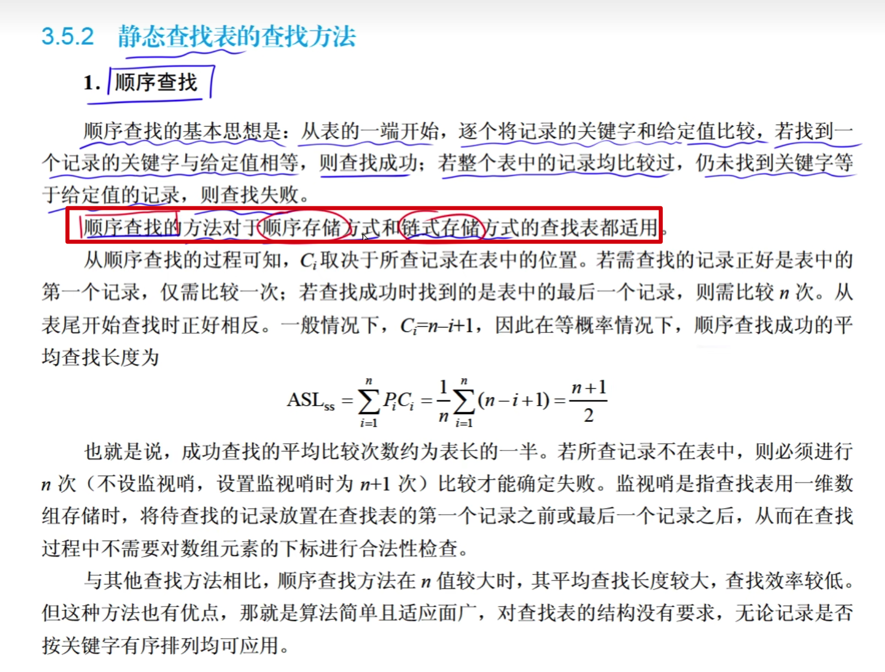

# 大O表示法

n: 问题规模

# 时间复杂度

# 空间复杂度

# 渐进符号

O: 上界，需要 >= n^2

# 递归时间、空间复杂度

当递归中有循环，并且根据n的数值变化决定循环的次数，则循环的复杂度为n，加上递归复杂度n，则为n^2

当递归方法中没有开辟新空间，则空间复杂度为 n

当递归方法中开辟新空间并随着n值改变空间大小，则空间复杂度为 n^2

# 递归式主方法

---

---

---

nlgn 是否满足第一个条件
明显不满足，则去第二种情况

即

则T(n) = 为A选项

---

# 线性结构与线性表定义

# 线性表的顺序存储

# 插入顺序表时间复杂度

插入的时间复杂度:

删除元素的时间复杂度:

查找元素的时间复杂度:

# 线性表的链式存储

# 线性表链式存储代码

删除和插入时间复杂度:

查询时间复杂度:

链表删除操尾节点的时间复杂度也是 O(n)，因为需要遍历上到上一个节点。

不需要遍历整个链表:

# 栈

总结:
假设序列为1,2,3
那么第一个元素 1<=K<=1.5 K = 1，
最后一个出栈的元素可能是2或者3，根据选项进行排查

总结:
入栈: ndoe.next = top, top = node;
出栈: top = node.next;

总结:一个空间被两个栈共享
top1: 栈1的顶部
top2: 栈2的顶部
假设共享空间为4个，让栈1填充这4个空间，那么top1 = 5(指向了第五个空间) top2 = 4

---

---

---

---

# 串模式时间复杂度

# 串的前缀和后缀

 

计算第i个字符的next值:
假设字符串 a a a a b
next[1]: 0
next[2]:
第2个字符前面的字符串 a
串中最长相等前后缀长度: a字符串没有前缀是和后缀式，因此不存在前后缀字符串相同的情况，因此前后缀相同的字符串长度为0
next[2] = 串中最长相等前后缀长度 + 1。
next[3]:
第3个字符前面的字符串是aa
前缀a 后缀a 前后缀相同，该相同的前后缀字符串长度是1
因此,next[3] = 1 + 1 = 2;
next[4]:
第3个字符前面的字符串是aaa
前缀a;aa;
后缀a;aa;
前后缀相同，该相同的前后缀字符串长度是2
因此,next[4] = 2 + 1 = 3;

# 一维数组

说明:
L:元素占用空间大小
LOC:第一个元素地值的首地址的第一个数值
    如a[0]的地址为1234，LOC=1
计算第i个元素的地址ai的表达式:
ai = LOC + i * L
如果第一个元素是a[1]而不是a[0],那么表达式:
ai = LOC + (i - 1) * L

# 二维数组

按列优先存储

N: 行 M: 列
LOC: 第一个元素地值的首地址的第一个数值
L: 元素占用空间大小

ai,j: 是a数组第i行第j列的元素的地址

公式:

总结: arr[X,Y] X代表行，Y代表列

解题技巧: 如果忘记公式了，则假设一堆数据，依次计算选项是否正确。

---

---

总结
偏移量相同指的是，行存储和列存储方式，元素位置相同。
如a[1][0]和a[2][1]都是第2个元素。

---

# 对称矩阵

对阵矩阵特点: Ai,j的元素地址 = Aj,i的元素地址
因此可以使用矩阵表示元素。

---

# 三对角矩阵

---

公式:

---

总结
如果没有记住公式可以按照计算位置的方式排除选项
因为是按行存储，A0,0 地址为1 A1,0地址为2，A1,1地址为3。

---

总结
假设n=3,那么A0,0在第一个 A2,2在第7个，使用选项排除。

---

使用到Ai.j = Aj,i的特点，带入法。

---

---

# 树的概念

树的度: 所有节点度其中的最大值。上图树的度=3

---

性质一:

性质二:

性质三:

性质四:

---

先求出总点数
度数之和 + 1
因为m=3,所以假设度为0的元素为a个，由性质一可知总结点数为20。
5 * 1 + 4 * 2 + 3 * 2 + 0 * a + 1 = 节点总和
5 + 8 + 6 + 1 = 20

a + 5+ 4 + 2=20

叶子节点的度为零，即a就是叶子节点的数目。

---

非叶子节点，包括分支节点和根节点
模拟树图，并带入选项排除
子节点: 度为零的节点

---

# 二叉树的定义

二叉树的根节点的子节点可以只有一个。

---

# 二叉树的性质

---

# 满二叉树，完全二叉树、非完全二叉树

完全二叉树:
第h-1层及以上层都是满的，并且h层从左到右不能有空的

---

# 二叉树性质4

类似于L的标记代表: 向下取整，反之向上取整。

---

---

# 二叉树的顺序存储

---

# 二叉树的链式存储

空指针域: 不指向任何节点

---

---

# 二叉树遍历方式

先序遍历: 根左右

---

中序遍历: 左跟右

---

后续遍历: 左右根

---

层次遍历: 按行依次遍历

---

# 根据遍历序列构造二叉树

先序的作用确定根节点
先序确定根节点A，确定左子节点B
再把B看作根节点，因为DG是左子树因此只能作为B的子树，所以把B看作根节点根据左跟右推出D的位置
依次类推。

---

根据左根右和左右根，还原树结构。

---

---

# 平衡二叉树

| 左子树的高度 - 右子树的高度 | <= 1 符合这个条件就是平衡二叉树

---

# 二叉排序树（二叉查找树）

总结: 每个子树大小满足  左 < 根 < 右

---

---

关键字: 根节点的值

关键码序列不一定是唯一的

解题:
根据关键吗序列构造树结构

23作为根节点，40大于23，作为23的右子节点，91>40作为40的右子节点，17<23作为17的左子节点，
以此类推，可以构造出上图树结构，因此答案选择B

---

# 最优二叉树定义

叶子节点的带权路径长度 = 每个叶子节点到根节点的路径长度 * 叶子节点的值
如2叶子节点的带权路径长度 = 2 * 2 = 4

带权路径长度 = 所有叶子节点的带权路径长度之和

带权路径长度最小的二叉树为哈夫曼树(最优二叉树)

---

# 最优二叉树构造规则

如给出权值 2 3 1 3
1. 始终从前往后找到最小的两个数，由0规则找出 2 1
2. 由 1 规则 把 1 最为左节点 把 2 作为有节点，两个节点之和 3 作为根节点
    
3. 把3作为权值放到末位从新构造出权值 3 3 3
4. 权值相同把前面作为左节点，后面作为右节点

 

---

因此最优二叉树的节点度为0或者2，只有这两个情况。

---

# 哈夫曼编码

26个字符至少可以使用5位二进制串表示
因为1位可以表示 0或者1 2个字符
2位可以表示 00,01,10,11 4个字符
2^x >= 26 x = 5

把权值转化为哈夫曼二叉树

节点路径分别标注0 1 编码
从根节点到各自节点所经过的编码 就是该节点的编码
如a的编码 1 1 0

---

# 哈夫曼编码压缩比

5个字符可知每个字符的可用3个等长编码表示
2^3 >= 5

上图可知使用等长编码占用300位

使用哈夫曼编码占用:

压缩比

---

模拟一个权值，构造树，代入法

---

---

每次都选择最优的方式为贪心，如每次都选择权值最小的两个权值

根据出现的频率构造出哈夫曼二叉树:

计算出编码长度:

---

构造一个哈夫曼二叉树，代入法
平衡二叉树: |左子树的高度-右子树的高德| <= 1

---

根据字符序列找出编码

---

第二个空需要反向译码

---

B选项指的是: 度为1的节点

---

完全二叉树一定是平衡二叉树

---

---

---

# 完全图

无向完全图: 给个定点都和剩余顶点有关系
等差数列: n-1 ,n-2 ,n-3 ... 0 
n(n-1)/2

有向完全图: n(n-1)

# 顶点的度

有向图分为出度和入度

---

图画，代入法
e: 边数
有向图/无向图总度 = 2e

---

---

# 邻接矩阵

有向矩阵: 第一行指向第一列的是否有路径 0 表示没有 1 表示有 如 1到4是1 说明1有箭头指向4。

---

---

无向图1数量 = 2e
有向图1数量 = e

---

邻接矩阵使用边多的
邻接表适合变少的

C选项不浪费空间

---

# 深度优先遍历

深度优先遍历运用了递归方式

当顶点没有指向时，再去遍历上一个节点是否指向

# 广度优先遍历

广度优先遍历:

先全部访问顶点的所有邻接点，然后再访问顶点的某一个邻接点的邻接点都访问完成后，再访问顶点的下一个邻接点。
A->B,A->C,A->D
B->E,B-F
C->1,C->..
D->3,D->..

---

不管是深度还是广度时间复杂度都是一样的
需要根据存储方式进行区别:
矩阵方式: O(n^2)
邻接表方式: O(n + e)

---

---

# 拓补序列

把没有入度的顶点以及关连边删掉，组成删掉订单的序列

---

---

---

# 查找基本概念

# 顺序查找

---

---

二分查找只能应对有序空间的查找，否则无法二分。 

---

查找过程

1. mid = (l + r)/2 = 5
当95大于mid时，l移到mid + 1位置
继续找mid

---

第一个元素查找长度为1，第二个查找长度为2 ... n-2,n-1 n
等差数列
总的元素查找长度：(1+n)n/2
平均： ((1+n)n/2)/n = (n + 1) / 2 

---

依次将选中的数值作为mid值和选项中的左后一位数值进行比较
将mid=45, 45 > 25 可知 l到r之间的数值是一定要小于45的，
10 < 25可知，
依次判断，l到r之间的数值是否小于mid值。

---

---

l移到r值+1位置
r仍然是13 

---

确定l到r的范围，然后判断下一个数是否符合l到r的范围。
如a选项 第二个mid值，有可能是 (1 + 4) / 2 = 2.5 即可能是15，也可能是19，因此 23 不在可能mid中，所以错误。

---

线性探测法:
 m: 表长
 k: 关键字
H(k) = 关键字 % m = j 如果有冲突，则(j + 1) % m
如果有冲突，则(j + 2) % m

---

同义词: key % m = j 
j相等的情况下 两个key为同义词
假如计算key=4，
那么冲突项是14，14和4 的模分别是 3和4，因此不是同义词

---
