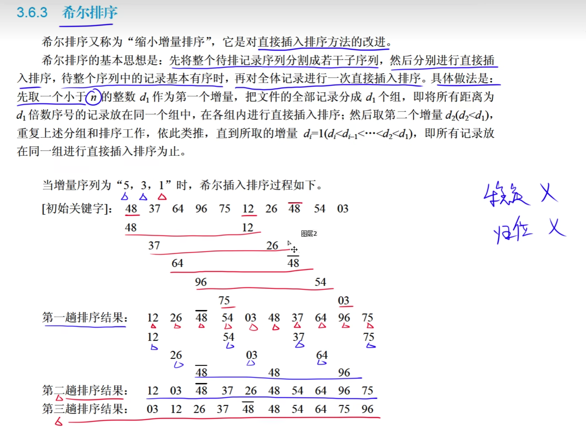
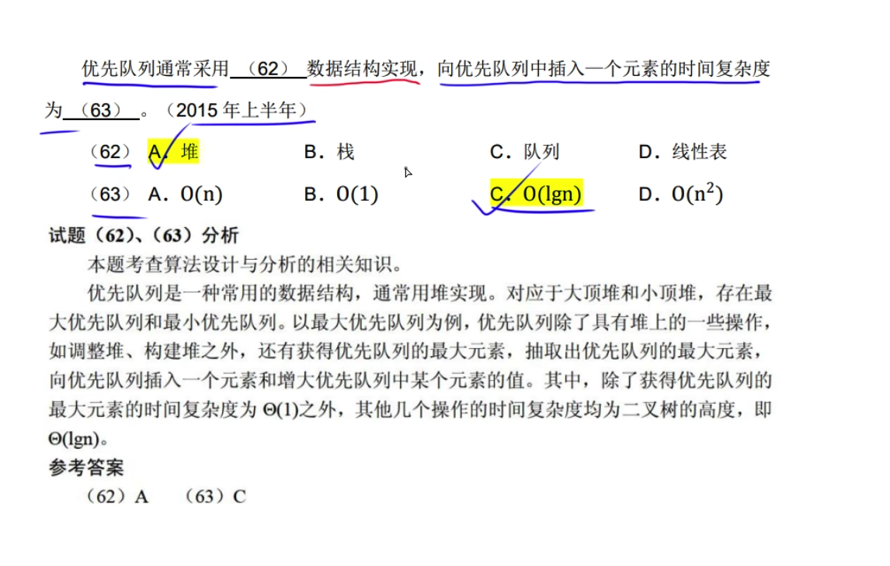

# 小顶堆和大顶推

---

# 建立小顶堆和大顶堆

根节点和最大子节点进行交换。

---

k的值1 55 2 60 3 40 4 10 ...
替换较小节点

---

解答：

将选项中的数值标记k，按照公式检查每个关键字是否满足公式。
ki<=2Ki and ki <=k2i+1

比如A选项中16要小于第二位和第三位数值

---

解答:
先构建二叉树

然后从低到上进行节点替换
根节点始终大于子节点
交换时取最大值

---

---

# 排序基本概念

上图快速排序的空间复杂度为 O(log2n)

# 直接插入排序

3 2 1 4 2

分别拿到第i个元素和前面的元素进行比较，如果小于前面的元素就插入该元素前面
2排到3的前面: 2 3 1 4 2
1排到3的前面: 2 1 3 4 2
1排到2的前面: 1 2 3 4 2
4不用动
2排到4的前面，2排到3的前面
最终排序: 1 2 2 3 4

两个2的相对位置不变，因此插入排入是稳定排序

---

第一轮:根据增量取一对数据，进行比较交换，
第二轮:根据增量取一对数据，进行比较交换，
当增量为1时为最后一轮

---

---

# 简单选择排序

目的把右边最小的元素找到，并替换第一个脚标元素

第一轮找到min最小的元素1，把1和第一个脚标元素替换

第二轮找到最小的元素2，把2和第二个脚标元素替换。

第i个位置就能确定最小的元素放到第i个位置，因此是归为排序

---

答案: A

选择排序有个交换的过程导致了元素不稳定，如17和第一个21进行了交换

---

# 快速排序

i = 第一个元素脚标 j = 最后一元素脚标
把第一个元素5作为枢轴
j向左查找小于5的元素，找到为4，把5放到第一个元素上
这时i向右查找大于5的元素，找到为7，把j=4 替换掉7
上面是第一轮j向左 i向右替换操作
当arr[i] <= 枢轴时，说明i和j之间没有元素了，就把枢轴元素5替换掉arr[i]
上面的步骤可以确保枢轴元素把序列分割成了两部分，左边都小于枢轴，右边都大于枢轴。
依次处理左右边序列

---

---

---

---

解答
以最后一个元素为基准元素时，要i先从左到右依次比较比4大的数，然后进行替换。
一趟i向右，j向左，因此移动了n位

---

---

# 归并排序

先将一组数，进行分组，直到一个元素为一组，组组之间进行比较，比较完成后，在作为新的一组进行比较

如 21第一组   31第二组

1 3    1  4

i          j   
第一组的i和第二组的j进行比较，
如果 i<=j 把i按序放到新组中
    i = i + 1, 第二组的j回退到最右边。
如果 i>j 把j按序放到新组中，这时j = j + 1,
i继续和j进行比较，知道i <= j时，i才加1

第i个元素依次和第j个元素比较。

---

举例比较

123 456

归并排序: 基本有序的一组进行排序，比较次数最少。和插入排序一样
快速排序反而比较次数多 O(n^2)

---

---

模拟一组数据按照归并排序。

---

---

# 杂题

强连通图指的是有向图，

连通图指的是无向图

---

二叉树排序: 跟节点大于左子节点小于右子节点

---

---

---

