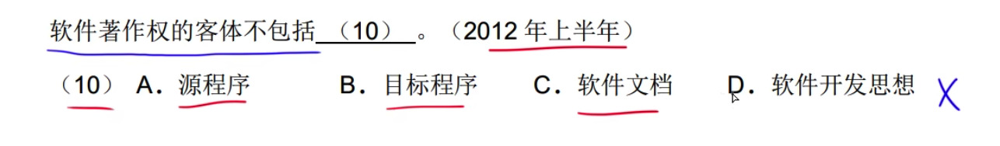
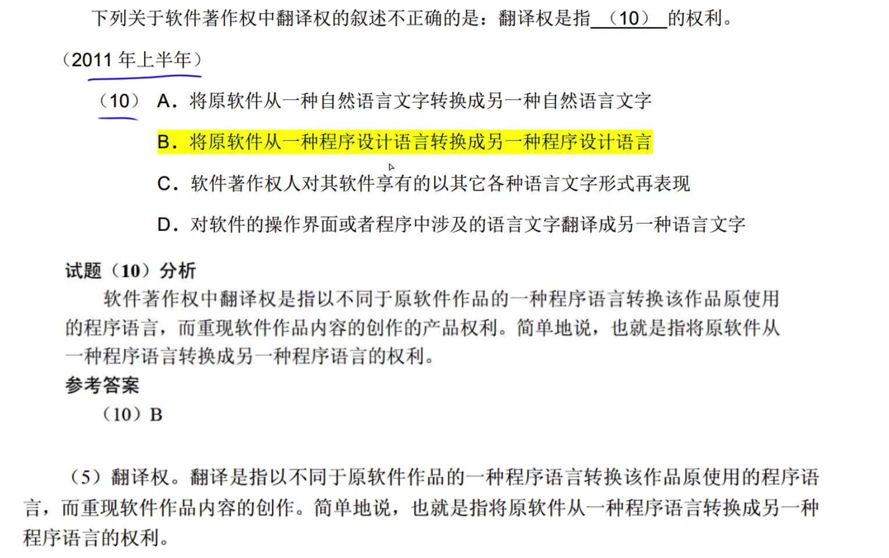

# 著作权

人身权有四个:发表权，署名权、修改权、保护作品全
发表权有时间限制，其余三个没有时间限制。

---

---

财产权: BD
人身权: AC

---

---

---

# 计算机软件著作权

---

---

A选项中软件盗版行为是指任何未经软件著作权人许可，擅自对软件进行复制、传播，或以其他方式超出许可范围传播、销售和使用的行为，软件盗版者不仅仅是非法拷贝、发布的人，还有传播等其他盗版行为的人也被称为软件盗版者。同时，更改软件的人也不能称之为盗版者。所以B选项说法错误。
D选项中的购买者没有对软件的复制权。

---

---

# 职务作品

打工仔只享有署名权

---

---

---

---

# 委托开发

A需要委托给B开发软件
A委托方(甲方) B是受委托方(外包公司)

---

---

如果没有合同说明，默认受委托方有著作权。

---

---

---

# 专利权

先申请者拥有专利权
先使用者拥有专利权
同一天申请，协商结果为准

---

---

---

---

商标权继续注册，

---

甲公司未注册，乙公司注册了不构成侵权

---

---

---

---

---

---