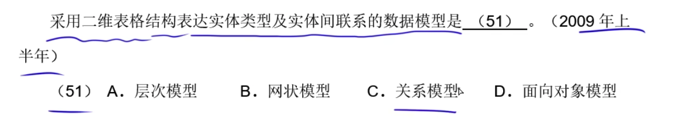
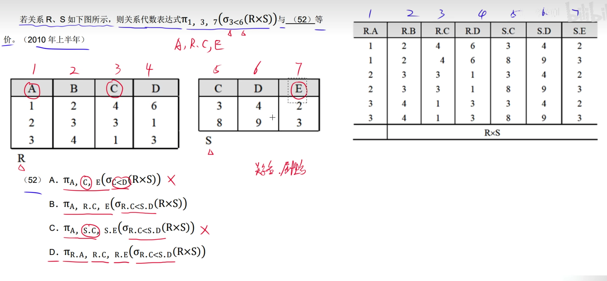
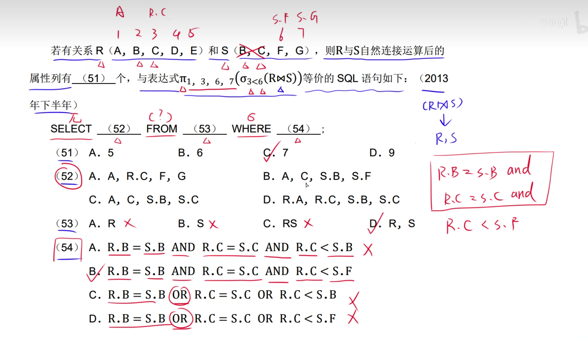
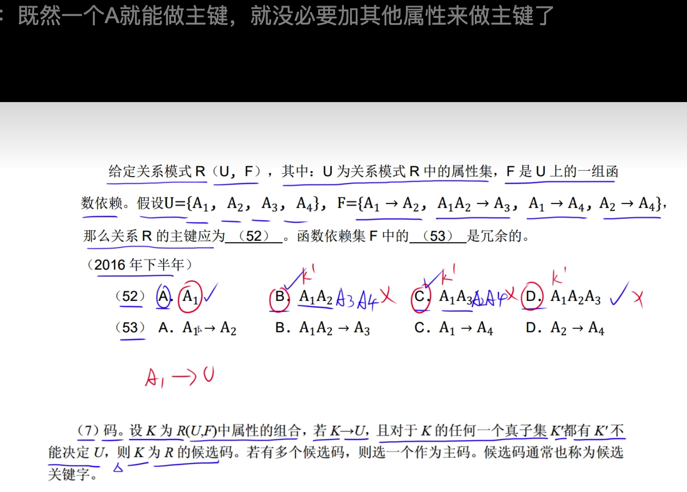
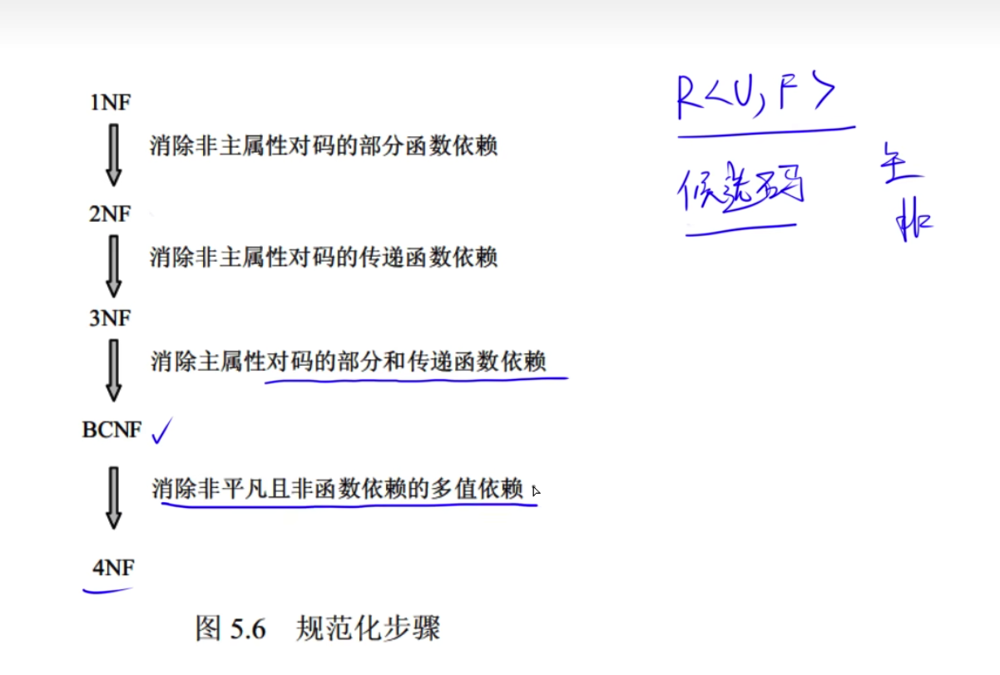
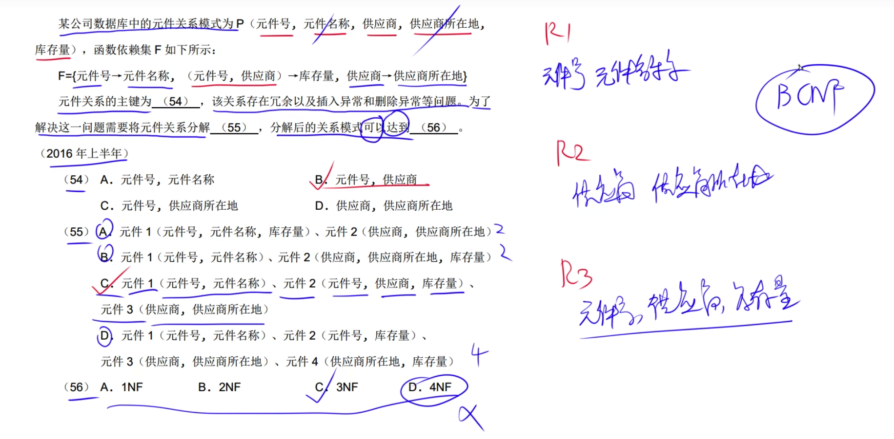
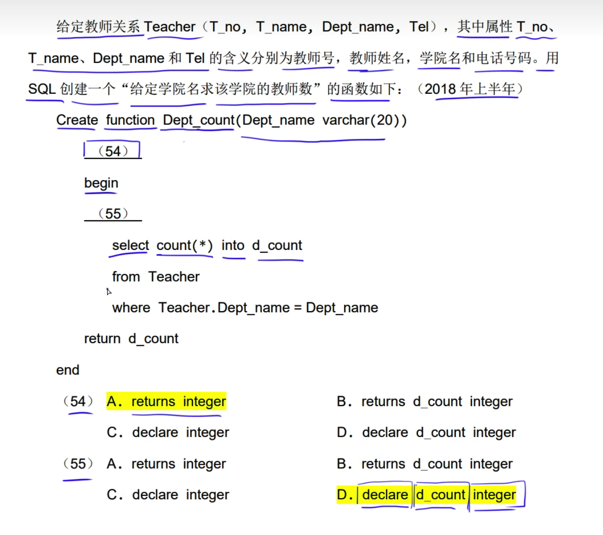

# 结构数据模型

关系模式使用二维表格表示

# 三级模式结构

---

# 两级映像

---

---

# 关系模式基本术语

关系模式: table(属性1，属性2
候选码: 主键ID,或联合唯一索引，能够标记一条数据
主属性: 主码中的属性

# 完整性约束

实体完整性: 主码的值不能为空，也不能部分为空
参照完整新: 外键一定能够在其他表中找到，或者外键为空

# 并，差，交，笛卡尔积

# 投影选择

投影:选择任意其中的列组合的新的关系
选择: 任意摸个字段=某个值 的数据组成新关系

B='5' B列等于5的元素
1='5' 第一个列属性等于5的元素
1=3 表示的是 第1列的值和第3列的值是否相等

# 等值连接

# 自然连接

1.笛卡尔积表
2.找到同名列，并把列值相同的找出，然后删掉后面表的该列
    R.A = S.A and R.B = S.B
3.A表每一行都和R表进行对比，存在一样则算为结果集。

---

---

---

---

自然连接如果没有匹配上则删除，如R.A1 and R.A2 都不匹配S表，则R的第一行删除

---

加单引号代表的是 第3列的属性值='销售部1'

先看第56个空，第四列是日期，因此选择C
又因为第55个空和第56个空时自然连接，因此一定有公共属性，公共部分只有商品号，因此投影中一定包含第一列

---

答案: BA

注意投影列的选择，没有括号则先投影在连接，如果有括号则先连接后投影

选出答案后和题目中的投影列进行比较，序号是否一致

---

# 自然连接转sql

R,S 表示笛卡尔积查询
自然连接，找到同名的列表，也就是条件使用并且符号进行连接

---

---

先筛选再笛卡尔积

---

这里是笛卡尔积，因此不需要排除列，所以序号为1~8

# 查询

---

---

---

# 函数依赖

R: 关系名
U: 属性
F: 函数依赖

包含关系

函数依赖: 某个属性由候选码中的属性决定
那么就称属性函数依赖与候选码
完全依赖: 学号和课程号共同决定成绩
部分函数依赖: 学号和课程号共同决定成绩，学号也可以单独决定成绩，那么成绩部分依赖候选码

多个数据性中若存在部分属性决定 Y 则成为部分依赖

传递依赖: X->Z X可以决定Z

Z包含于Y, 又 X->Y 因此 X->Z

# 属性闭包计算

根据生成的闭包，匹配关系并替换
求A的闭包: A可以决定B，A可以决定H => (ABH)
求ABH的闭包: A可以决定B => (ABH)
    B可以决定DH => (ABDH)
    H没有=>(ABDH)
求ABDH的闭包:
    A可以决定B B已经存在=> (ABDH)
    B可以决定DH DH已经存在 => (ABDH)
    D没有
    H没有 因此结果是(ABDH)
当这次结果和上次结果一样时就停止。

说明A是表的候选键，因为A闭包结果包含了所有的列
又因为只有一个属性A时候选码，因此A也是主码

候选码: 根据关系属性能推导出所有的属性

---

没有在右边出现过的属性，候选码一定包含该属性
如A不能被其他属性决定，因此候选码一定包含A

然后使用代入法，根据选项求闭包

主属性: 包含在候选关键字中的属性都是主属性，
AC AB 包含 A B C 因此有3个主属性 0个非主属性

---

---

所有属性就是全码

---

---

A->BC 可以分解为: A->B 和 A->C

---

---

---

真子集能够决定U那么其不是候选码
答案:AD

# 第一范式

候选码中包含的属性为主属性，不包含的属性为非主属性。

改成如下，就能保证满足第一范式

# 第二范式

候选码有: (学号，课程号)
完全依赖: 如  学号课程表->成绩 
不在候选码中的属性为非主属性，如姓名、学院、院长、课程名
学号可以单独决定姓名，因此姓名为部分依赖与候选码
成绩完全依赖与候选码。

# 关系模式分解

把非主属性分解出去，并添加决定非主属性的属性，
让主属性和非主属性构成新的关系
同理 课程号 课程
同理 学号 课程号 成绩

保证分解后的关系:
每一个非主属性都完全函数依赖于候选码，该候选码可以使主键或者联合主键

第一范式和第二范式存在函数传递依赖，因此仍然有冗余和操作异常。

# 第三范式

传递函数依赖中，如果X->Y Y->Z1,Z2,Z3
那么Y->Z1,Z2,Z3可以分解成关系
Y Z1 Z2 Z3

第三范式存在的问题:

找出候选码:
    (书店，图书)、(店长，图书)

第一范式: 每个属性都不能再分为子属性
第二范式: 每个关系中，属性都完全函数依赖于主属性
第三范式: 每个关系中，非主属性都不非传递函数依赖于候选码
    库存量也都是由候选码中的属性所决定的，因此不存在传递函数依赖于候选码
    存在的问题: 主属性存在对候选码的分部分函数依赖或者在主属性和候选码之间存在传递依赖

存在主属性对部分候选码的依赖，如书店，部分依赖于候选码(店长，图书)中的店长

为消除第三范式存在的问题: 主属性存在对候选码的分部分函数依赖或者在主属性和候选码之间存在传递依赖。
需要解决该问题，使第三范式升级为BCNF。

候选码: 候选码属性能决定所有的属性

主属性对候选码的部分函数依赖或传递函数依赖

总结:

---

判断非主属性部分函数依赖于主属性的技巧:

找到主属性和非主属性

候选码有: (时间，学生)
因此主属性有: 时间 学生
非主属性有: 课程 教师 成绩 教室
找到非主属性依赖于部分主属性
根据关系依次判断 ？-> 课程  (时间，教室) -> 课程
这里时间，教室看做整体，因此课程不部分依赖于主属性

(时间，学生) -> 教室
(时间，教室) -> 课程
因此有: (时间，(时间，学生)) -> 课程 即 (时间，学生) -> 课程
课程 -> 教师，所以: (时间，学生) -> 教师
因此非主属性教师对码存在传递函数依赖。
如下图:

判断是否满足第二范式:
    非主属性不部分依赖与候选码
判断是否满足第三范式:
    非属性不存在传递依赖于与候选码
判断是否满足BCNF:
    主属性不部分依赖于候选码，而且主属性不存在传递依赖于与候选码

---

解答:
是否满足第二范式:
判断非主属性是否不部分函数依赖于候选码
例如存在: 时间->非主属性或者学生->非主属性，则认为非主属性部分依赖于候选码。
因为教室完全依赖于候选码，因此不满足部分依赖的条件，
所以非主属性不部分依赖于候选码，符合第二范式。

是否满足第三范式:
非主属性不存在传递依赖于候选码

由于(时间,学生)->教室，（时间,教室）->课程，
因此有（时间,学生）-> 教室
所以，非属性书存在传递依赖于与候选码，则不满足第三范式

第56空

找出主属性:
R的关系有 (学生,课程)->成绩
(学生,课程)

判断是否满足BCNF范式:
主属性不部分依赖于候选码也不存在传递依赖于候选码

---

A

---

---

---

# 关系分解

---

唯一索引或者联合索引为 候选码

存在传递函数依赖

---

需要把部分函数依赖分解出去
零件名称和供应商所在地，为部分函数依赖，需要单独拥有关系。

---

---

# 保持函数依赖

判断是否有损连接:
相互自然连接后的属性是否缺少，如果有缺少则有损

判断是否保持函数依赖:
题目中存在的关系能在分解后的关系中找得到

选项关系中，都能找到给定的关系 
分解后，所存在的关系是否都能在题目中表现
如 A选项中无法找到C->D的关系

---

无损连接: 分解关系中自然连接后，都能找到属性

函数依赖: A1A3->A3
分解后都不存在函数依赖

---

无损连接: 关系之间一定有交集

# 需求分析阶段

---

---

# 概念结构设计

---

---

---

---

---

---

---

---

52:C

---

# 事务管理

---

---

---

事务对数据加排它锁，则其他事务不能再加任何锁
事务对数据加共享锁，则其他事务只能再加共享锁

---

---

---

---

---

---

---

---

---

---

---

