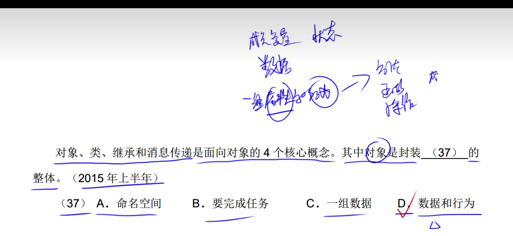
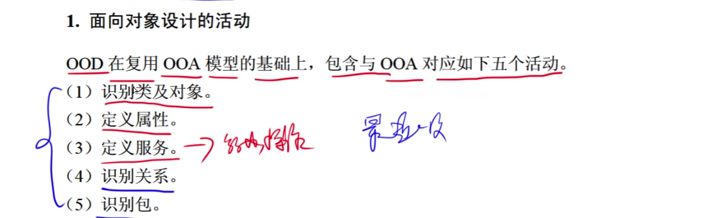
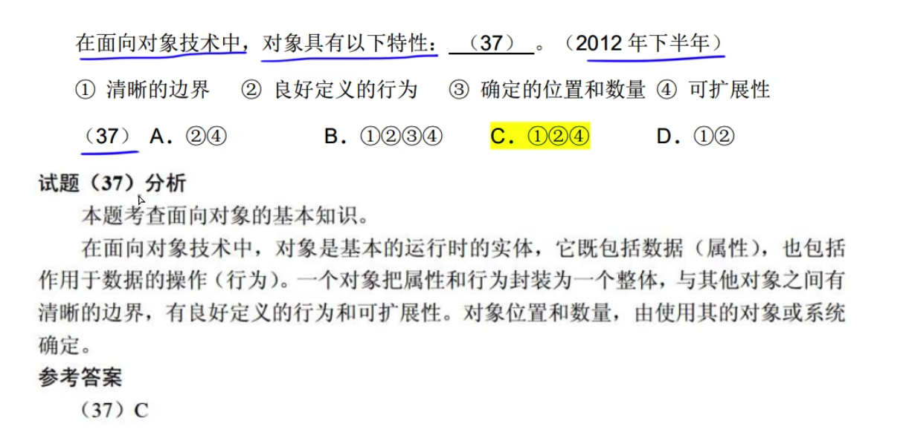
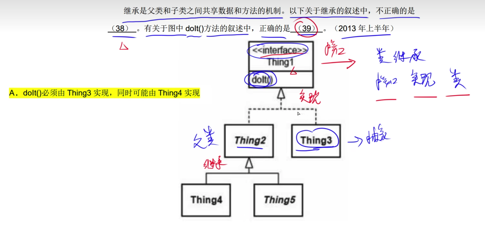

# 类

---

---

---

---

---

---

---

---

类是对象的抽象，对象是类的实例

---

---

---

---

---

---

---

---

---

---

---

---

---

---

---

---

---

---

父类可以出现的地方，子类一定能够出现。

---

共同重用: 包中一个类可用，那么该包所有类都可用。

---

接口分类: 依赖于抽象，而不依赖与细节
里氏替换: 包中一个类可用，那么该包所有类都可用。

---

---

---

---

 

---

面向对象设计步骤:
分析
设计
实现代码 程序设计
测试

---

---

面向对象分析步骤:
认定对象
组织对象
之间作用
确定对象操作
定义对象内部信息

---

---

面向对象设计主要活动:
识别
定义属性
定义服务
识别关系
识别包

---

---

---

---

---

---

---

