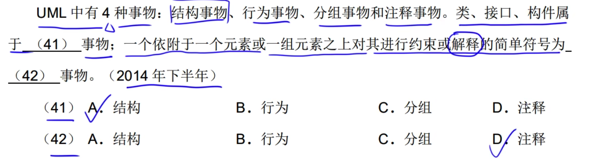
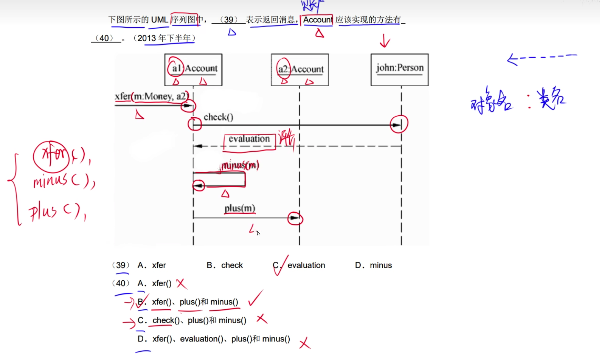
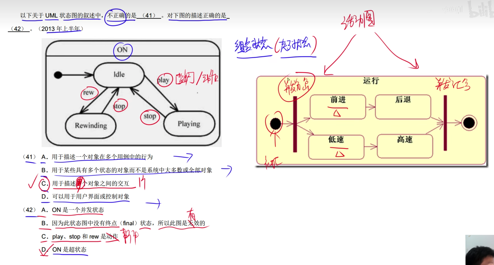
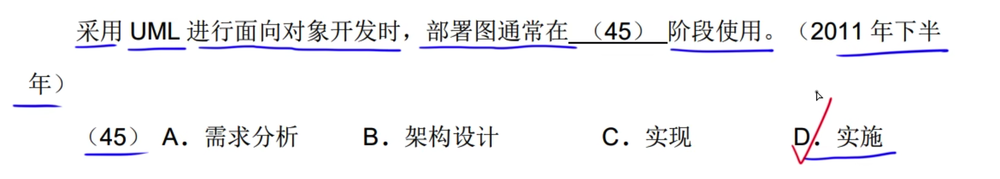

# 1.UML事物

---

# 2.关系

员工部分 公司整体 公司消失了员工仍然存在
鸟      鸟群    鸟群小时了鸟仍然存在

非直接对象: 子类或继承
直接对象: 可以创建对象
因为是抽象类，因此不存在直接对象

---

# 3.图

### 3.0类图

## 3.1对象图

---

## 3.2用例图

### 3.2.1包含关系

---

### 3.2.2扩展关系

---

### 3.2.3泛化关系

## 3.3用例图

---

## 3.4序列图

## 3.5通信图

## 3.6状态图

### 3.6.1状态和活动

### 3.6.2转换和事件

触发事件执行并且满足监护条件才会去执行动作。

状态在B2时事件e2触发才会去转换
如果状态在B1,触发事件e2那么状态不会离开B
???

???

---

---

### 3.7活动图

### 3.8构件图

### 3.9部署图

???
