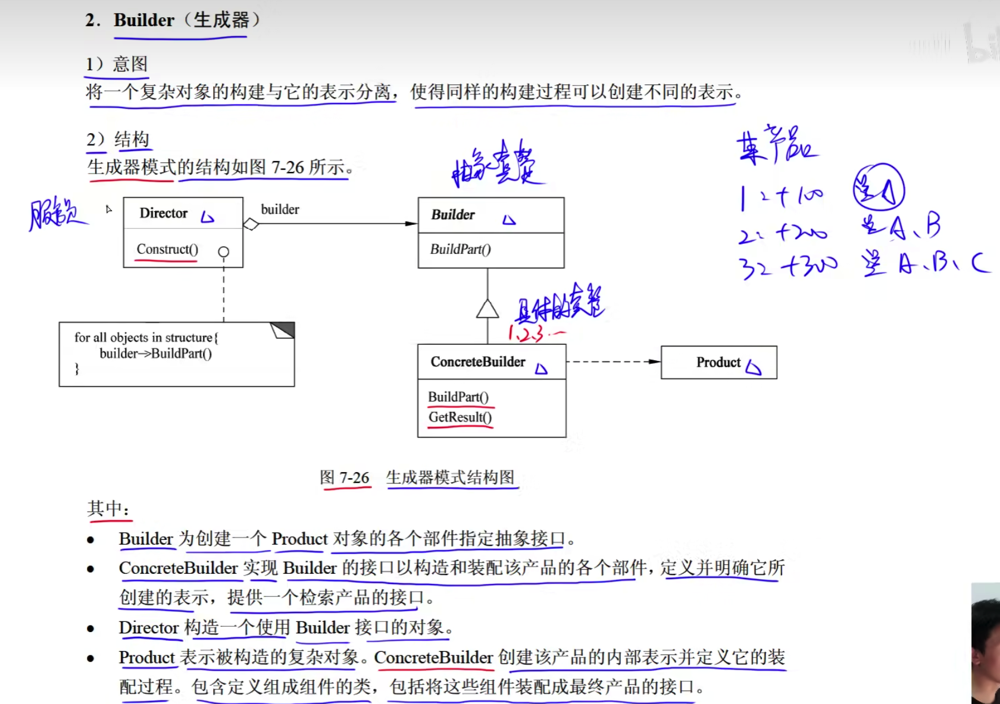
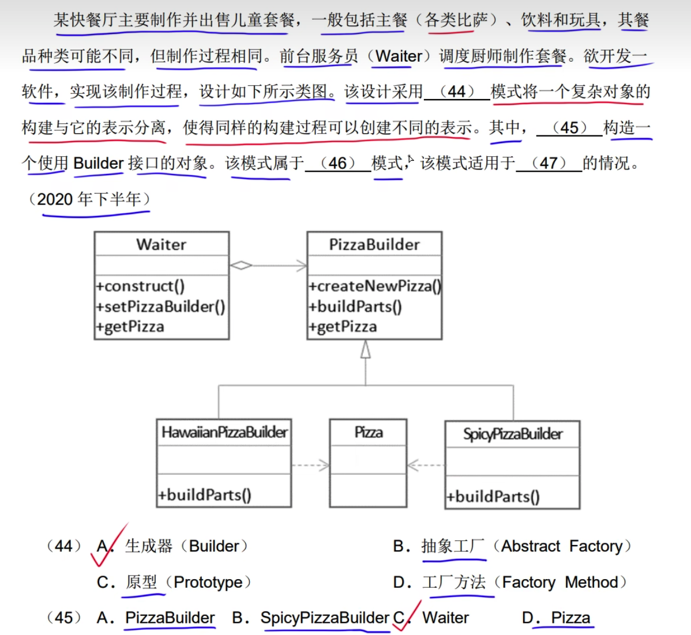
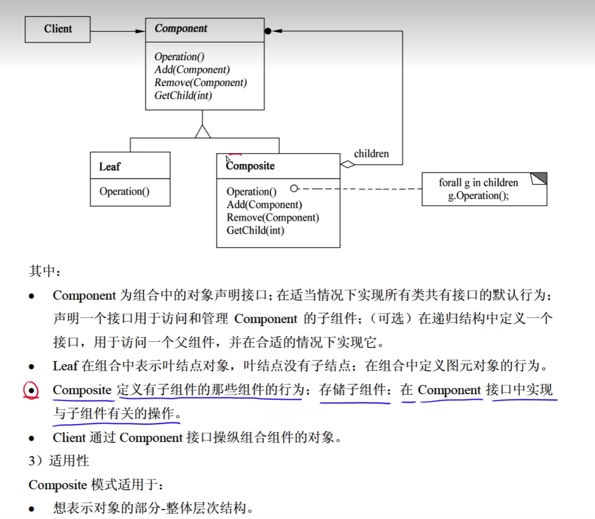
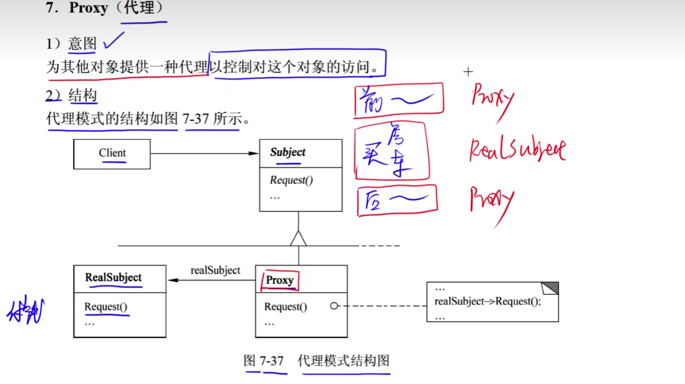
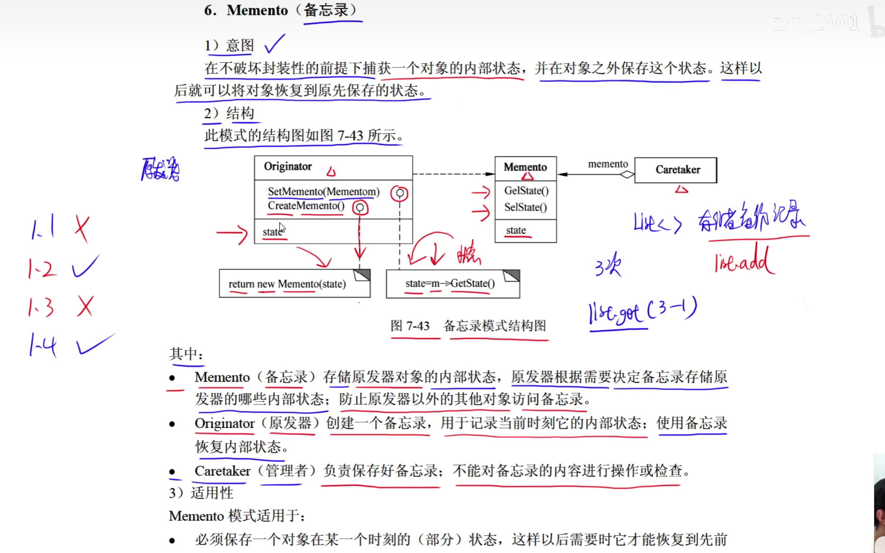
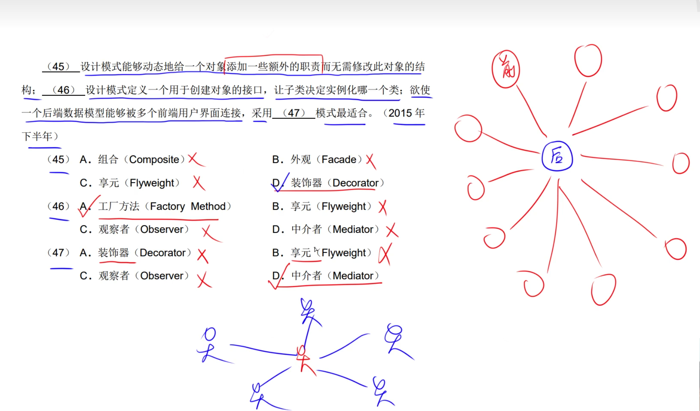

# 1.分类

# 2.设计模式

## 2.1简单工厂模式(不属于23中设计模式之一)

## 2.2工厂方法模式(Factory Method)

如需要一个产品对象，我不知道这个产品对象是什么，这是需要调用产品工厂方法，让产品工厂方法创建产品，因为产品工厂类知道它要创建哪些类。

## 2.3抽象工厂模式(Abstract Factory)

## 2.4生成器模式(Builder)

Builder: 抽象创建
ConcretreBuilder: 具体创建
Product: 产品，包含产品功能: 升级产品，更换产品
Director: 构造一个Builder对象

## 2.5原型模式(Prototype)

## 2.6单例模式(Singleton)

## 2.7适配器模式(Adapter)

## 2.8桥接模式(Birdge)

## 2.9组合模式(Composite)

## 2.10装饰器模式(Decorator)

## 2.11外观模式(Facade)

## 2.12享元模式

## 2.13代理模式

## 2.14责任链模式

## 2.15命令模式

## 2.16解释器模式

## 2.17迭代器模式

## 2.18中介者模式

每个对象中中都有中介者对象，对象之间的通讯使用中介者完成
每个对象初始化中介者，中介者初始化所有的对象。

## 2.19备忘录模式

## 2.20观察者模式

## 2.21状态模式

## 2.22策略模式

## 2.23模板方法模式

## 2.24访问者模式

