# 操作系统地位

# 顺序执行

# 前趋图

P1执行中: V(S1) + 1
P2执行前: P(S1) 是否是等于 0 如果等于0，则可以执行P2

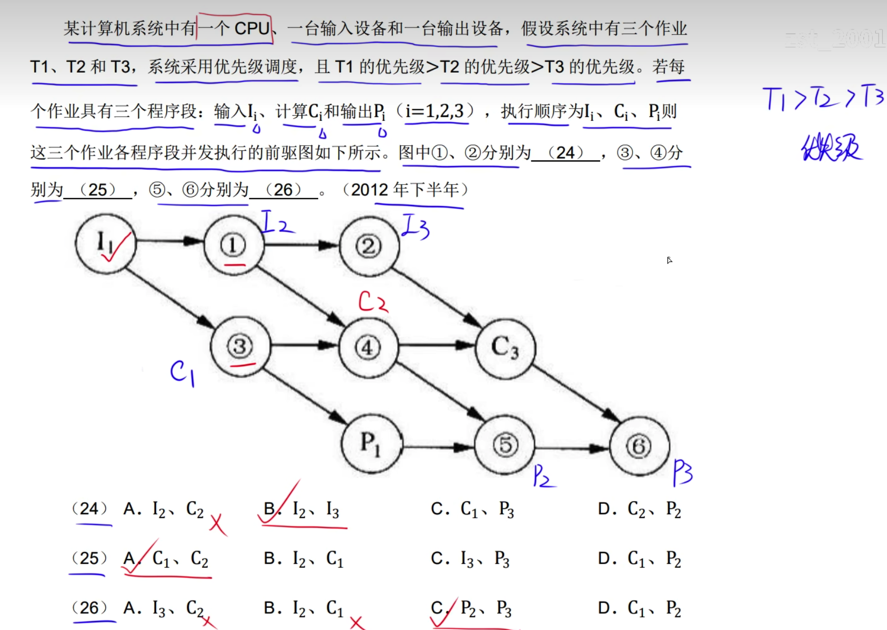

# 三态模型

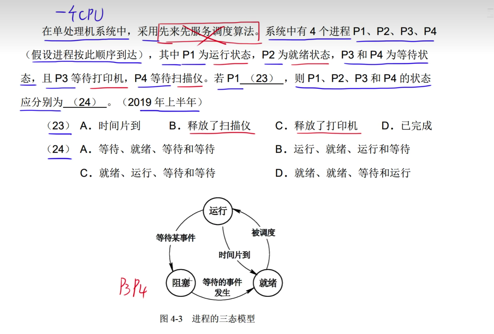
因为P4为等待扫描仪，如果P1释放了扫描仪，则P4应该进入就绪状态

# 同步互斥

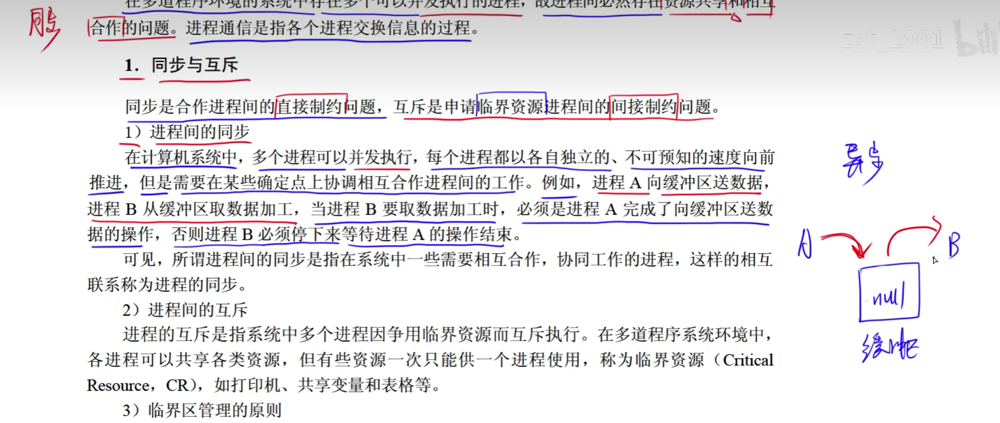

# 信号量机制

P:申请资源
V:释放资源

# 同步操作

# 死锁

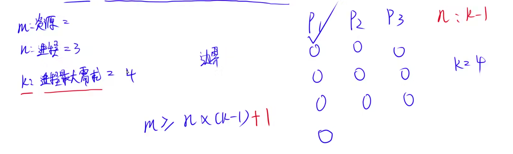

---

---

# 进程资源图

---

---

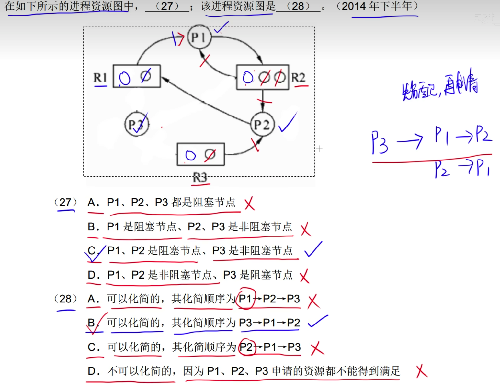

---

补充仍需 可用

运行P4时先分配，然后再还回去，根据已分配资源数还回去。

# 多线程

# 局限性原理

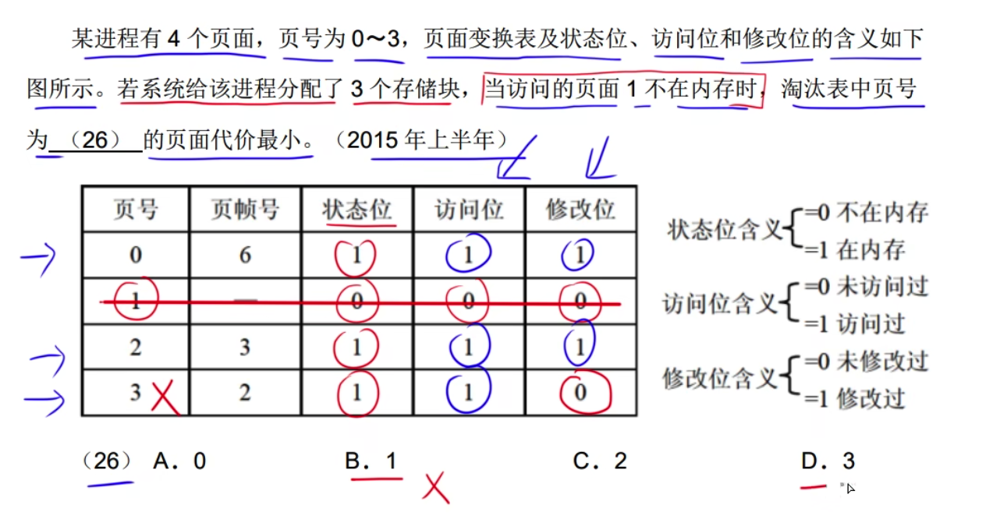
优先淘汰未被访问过的数据，然后是未被修改过的数据

# 分页存储管理

---

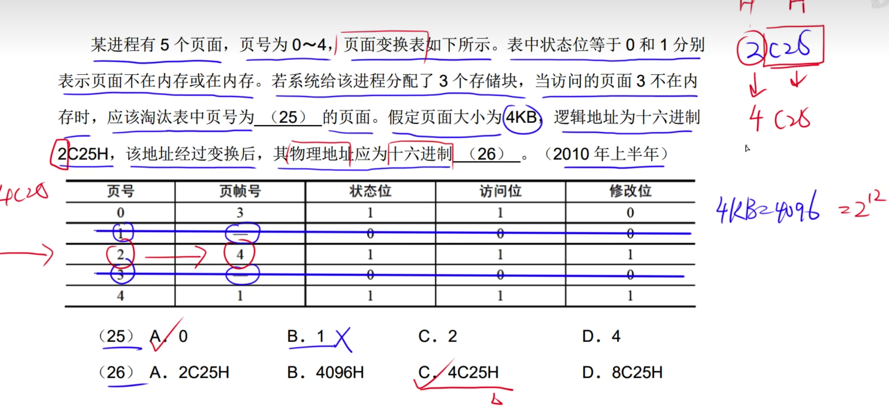

1024十进制转化为二进制 100 0000 0000

1KB =  2^10B 说明 页内地址占了10位 

分页地址 = 页号 + 页内地址 因此100 0000 0000 中1为页号

由图可知页号对应物理页=3

---

# 单缓冲区

# 磁盘调度算法

先把柱面号从小到大排序

---

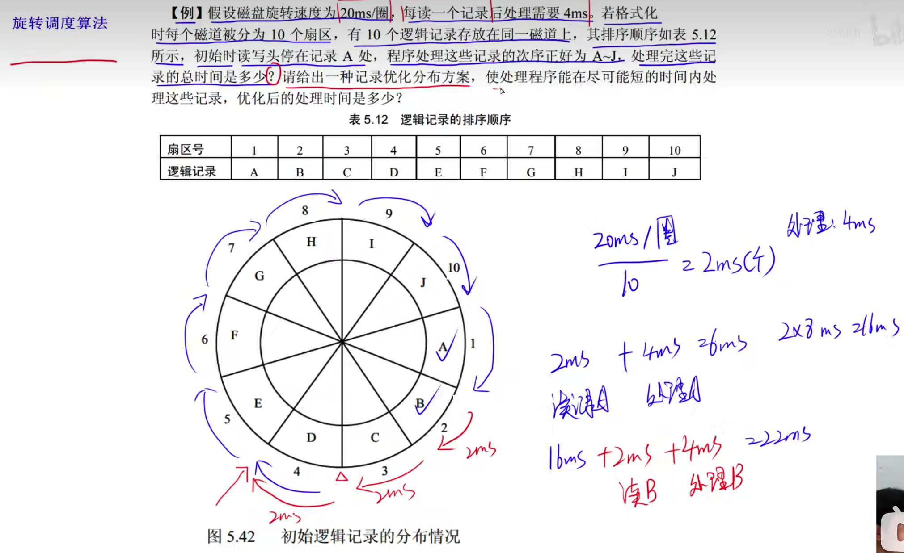

---

n: 记录数

t: 每个扇区读时间 = 一周所需时间/n

th: 每个扇区处理时间

处理时间消耗掉几个扇区: 处理时间/每个扇区读取时间

处理一个扇区浪费所需时间: (n - 处理时间消耗掉几个扇区) * 读一个扇区消耗时间 + (t + th)

总时间: (n-1) * 处理一个扇区浪费所需时间  + （t+th)

n=9

t=27/9=3

th=3

(9-1)*3+(3+3)=30

总时间:(9-1)*30+3+3=246

答案应该是246   最少时间 = (读时间 + 处理时间) * n

---

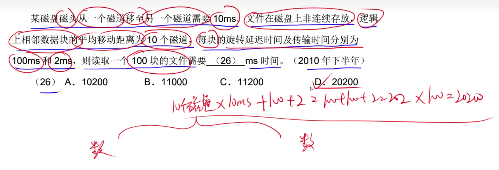

(磁道移动时间 + 处理时间)  * 块数

（10 * 10 + 100+2）* 100

（每块的磁道数 * 磁道消耗时间 + 每块消耗时间)* 块数

---

# 多级索引结构

采用一级索引: 170个地址 每个地址指向一个磁盘块 因此 170 * 512B / 1024 = 85 

---

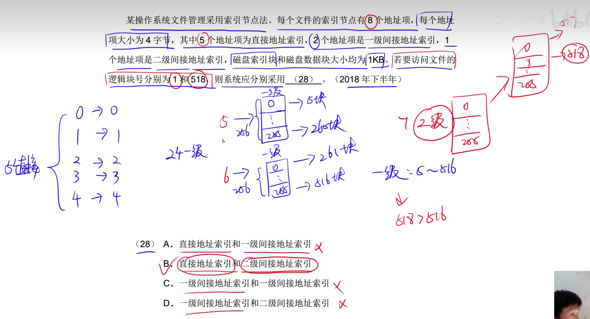

# 文件目录

# 位示图

一位表示一个物理块

4096/32 = 128个字左右

判断范围在128个字左右，第一个字表示0~32 因此第129个字表示 4096~...

代表一位指向物理块的大小为1M,

(200 * 1024/1)/32 = 6400

---

先计算有多少块
块数 = 200GB/1MB
1字 = 32位 即可以指定32个物理块
块数/32 = 字长

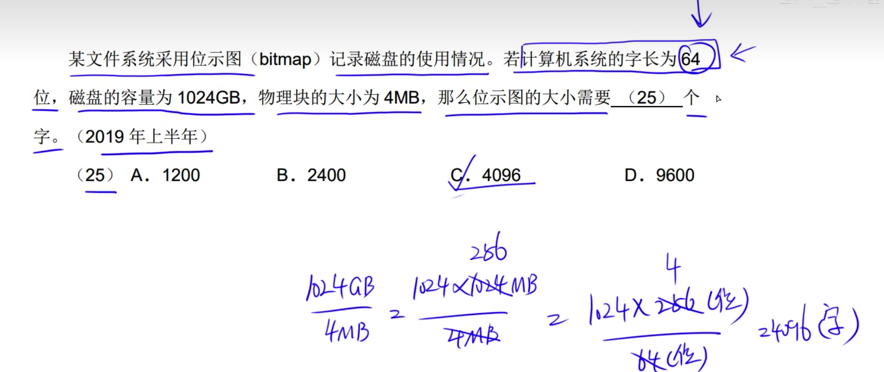

# 杂题

