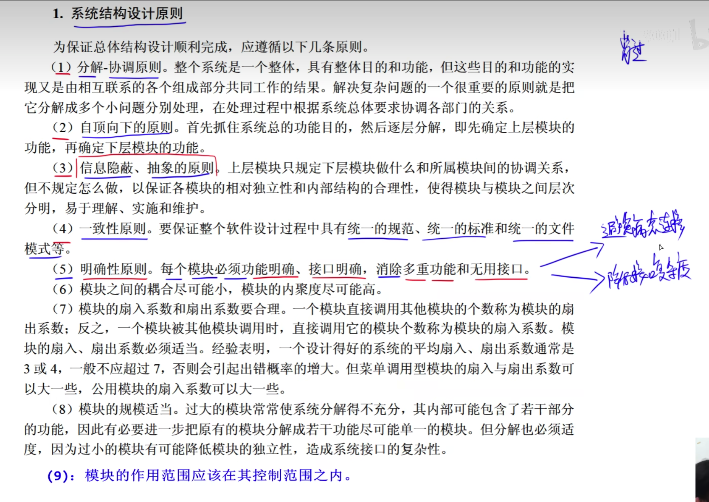
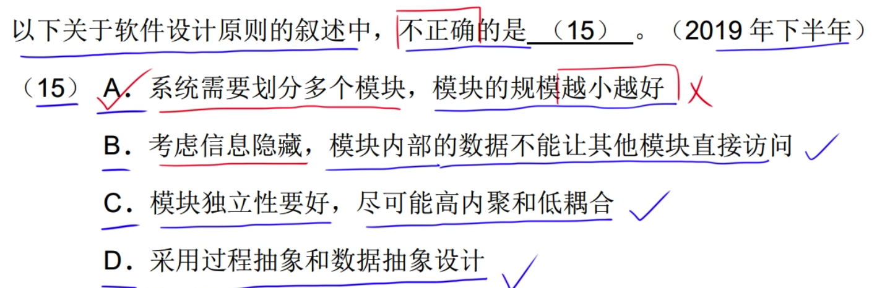
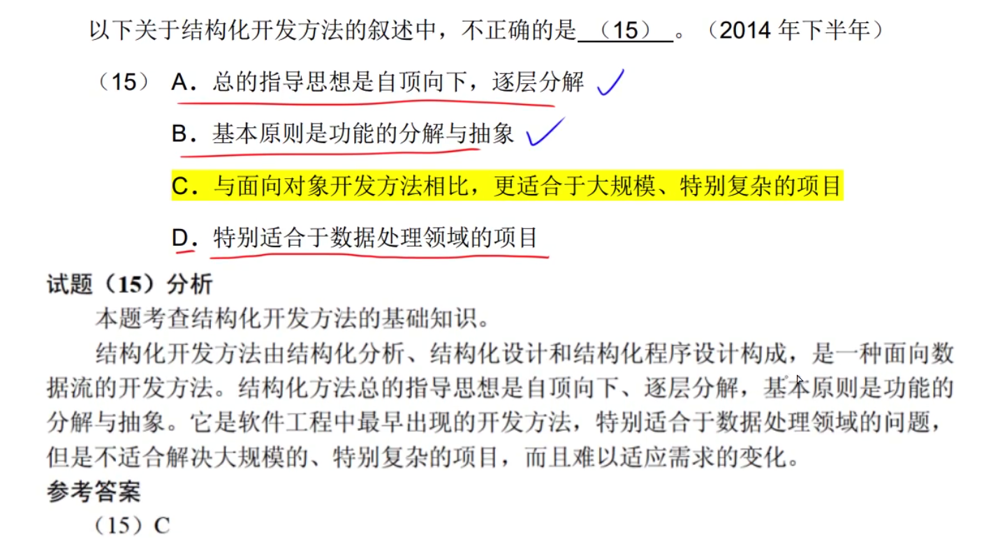

# 耦合

# 内聚

# 设计原则

可以完善高内聚低耦合功能

---

---

# 系统文档

# 外部系统

# 数据存储

# 加工

# 数据流

# 加工既有输入数据流又有输出数据流

父子图平衡: 有几个数据流程目的都能在子图中找到
加工有输入就会有输出

功能指向是否一致

数据流至少有一个加工

加工至少有一个输入流河输出流

​	B

---

---

---

---

---

---

---

---

---

# 杂题

---

---

---

---

---

---

---

---

---

---

---

---

---

---

---

---

---

