# CMM

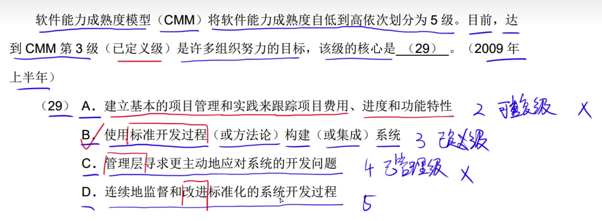

# CMMI

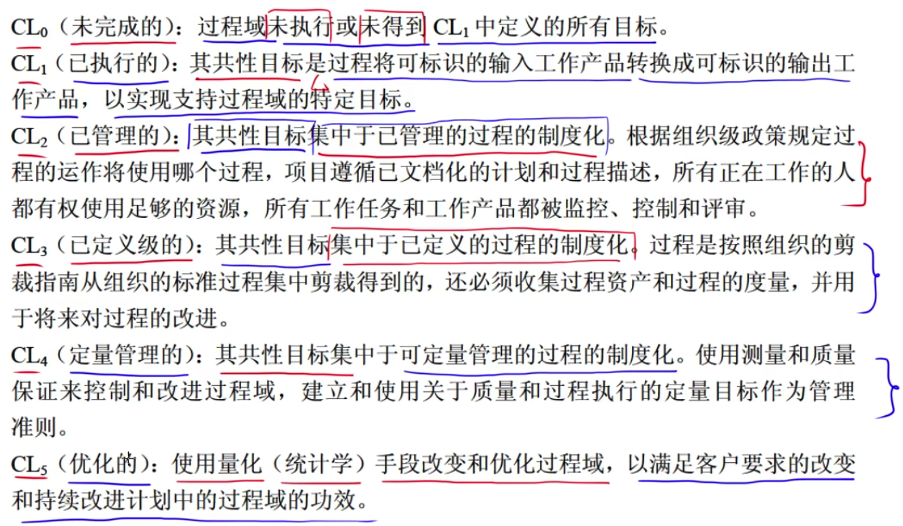

# 软件过载模型

## 瀑布模型

## 增量模型

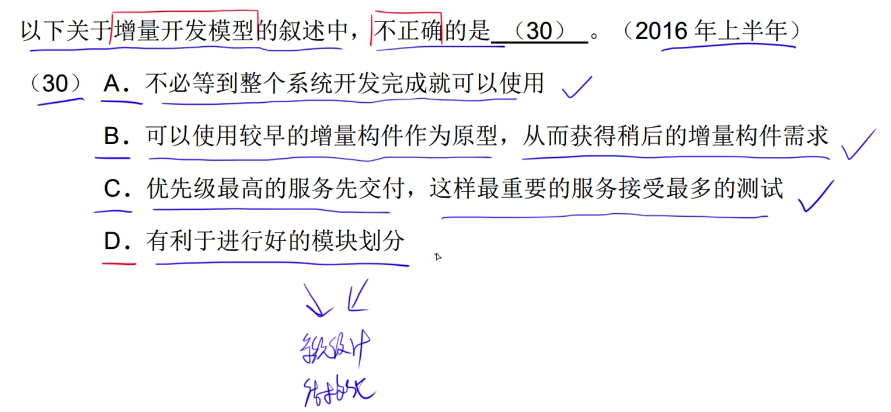

## 原型模型

---

---

瀑布不适合需求不明确，需求经常变更的情况

---

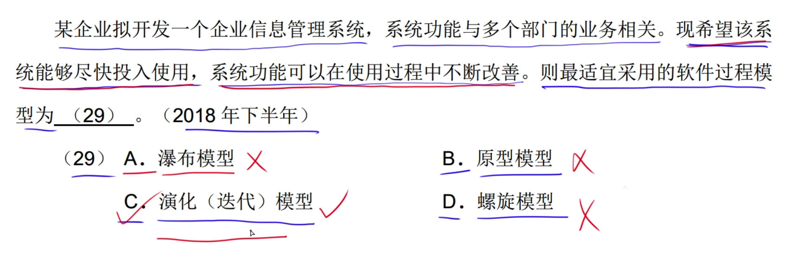

---

# 螺旋模型

---

---

---

---

# 喷泉模型

---

---

---

---

# 统一过程(RUP)模型

---

---

---

# 敏捷开发

---

---

---

# 软件需求

---

---

---

# 系统设计

---

---

---

---

# 系统测试

---

---

---

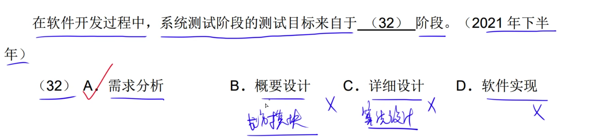

---

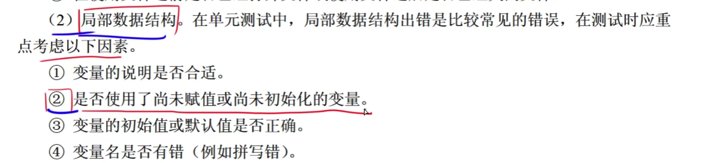

---

---

---

---

# McCabe

---

---

# 路径覆盖

分支覆盖(判定覆盖/条件覆盖): 
测试用例数目总和，覆盖的场景中满足条件至少真假一次

---

语句覆盖: 需要满足走到执行语句的条件

路径覆盖: 所有真假组合场景

---

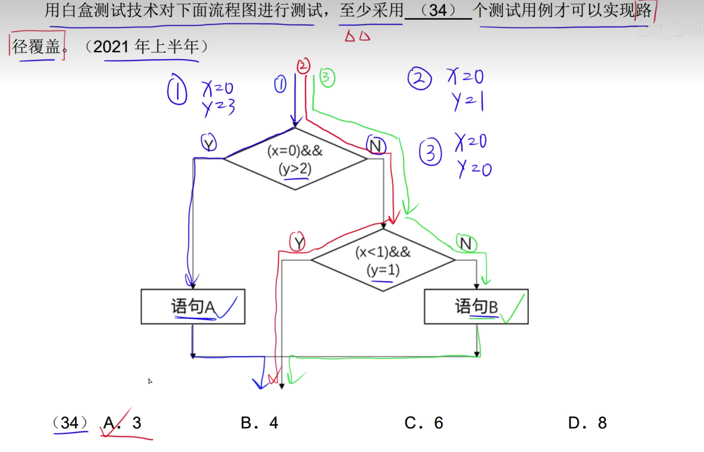

---

简单路径: 条件结果不能重复的路径
环路复杂度:
    边 - 点 + 2
    或者环路数+1

---

路径覆盖:
条件组合有多少种能够满足该流程图

---

语句5由两个分支过来，因此指向语句5的有两个箭头，语句6也是一样
13 - 11 + 2  = 4

---

---

---

for循环: for循环条件第一句就为一条语句

---

while: while条件前面有一条语句

---

do while: do前面有一条语句

---

第一个语句...最后一个return语句

条件覆盖: 每个判断语句都满足真和假场景
假设一组数据，代入

---

---

# 系统可维护性指标

---

---

---

---

# 软件维护

---

---

---

---

# 软件文档

---

---

---

# 软件维护

---

---

---

---

---

---

---

---

---

---

# 可靠性、可用性、可维护性

---

---

---

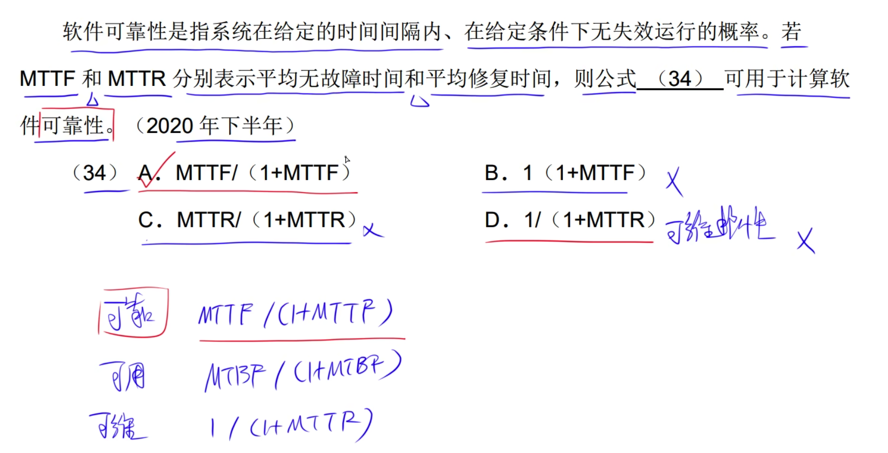

---

---

# 沟通路径

---

---

---

# 软件项目估算

---

---

---

---

---

# 项目活动图

关键路径长度: 经过节点的最长时间，如果多个路径指向同一个节点，取最长时间的路径
松弛时间: 标记每个节点所需要的最长时间 - 上一节点到当前节点所需要的时间
I当前节点 = 17
H到I节点所需要的时间 = 3
17 -3 = 14
而到H节点所需要11,14 -11 = 3 因此3位松弛路径
当松弛路径=0为的节点为关键路径节点

---

---

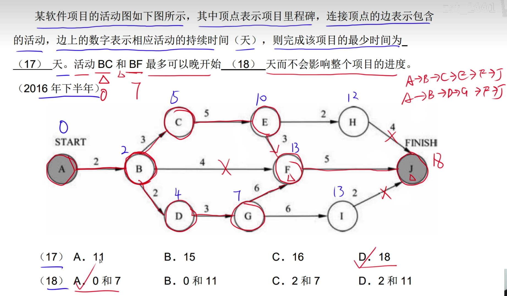
最少时间: 最长消耗
找出关键路径，如果节点在关键路径中，则松弛时间等于0，即最多可晚0天

---

---

# 画项目活动图

工作周期: 当前节点完成下个节点所需要的时间

---

缩短关键路径的节点周期才能缩短项目完成时间，
因此需要找出不在关键路径上的节点。

# 软件配置管理

---

---

---

---

---

# 风险管理

---

---

---

---

---

---

---

---

---

---

---

---

---

---

---

---

# 软件质量

---

---

---

---

---

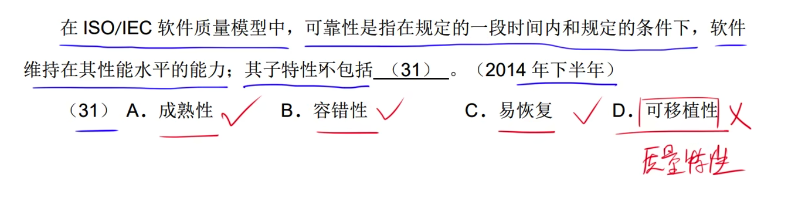

---

---

---

---

---

---

---

---

---

---

---

---

---

---

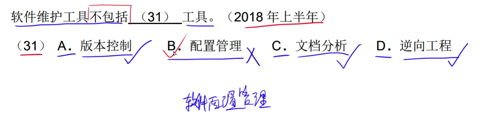

---

# 杂题

---

---

---

---

---

---

---

※号只需了解