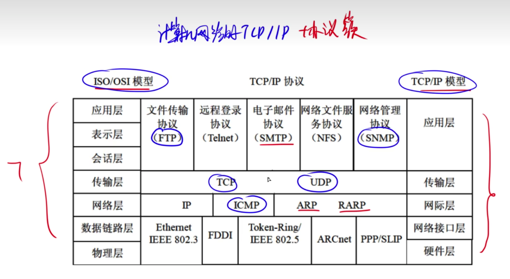
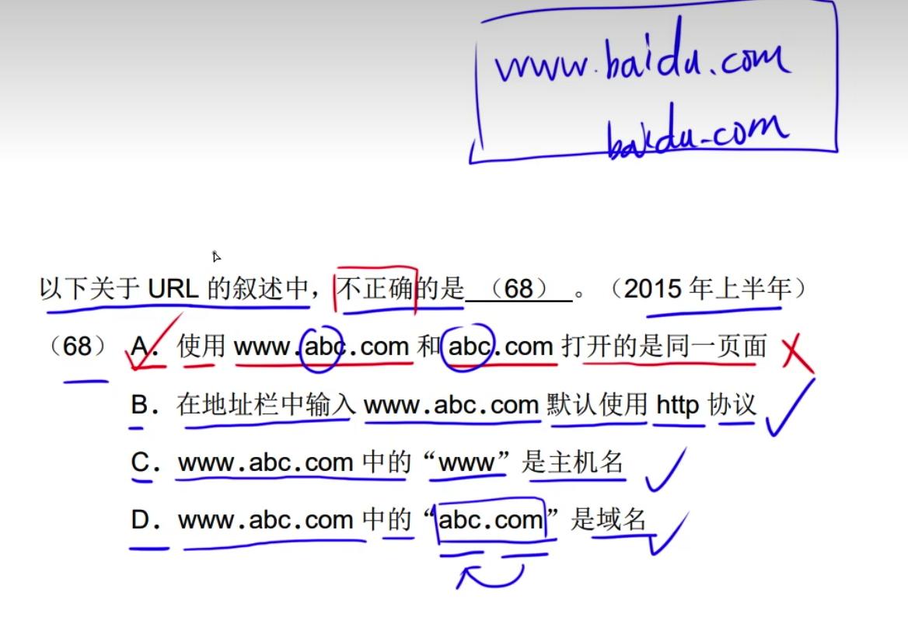
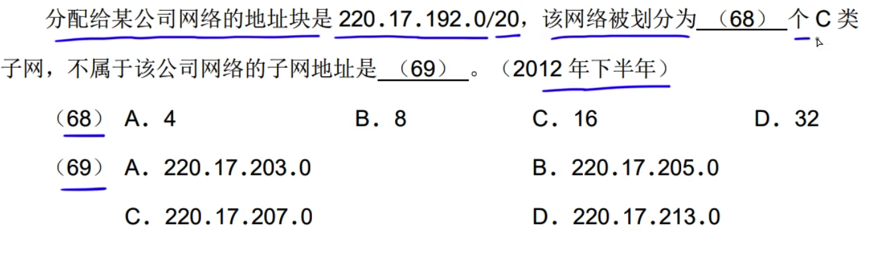
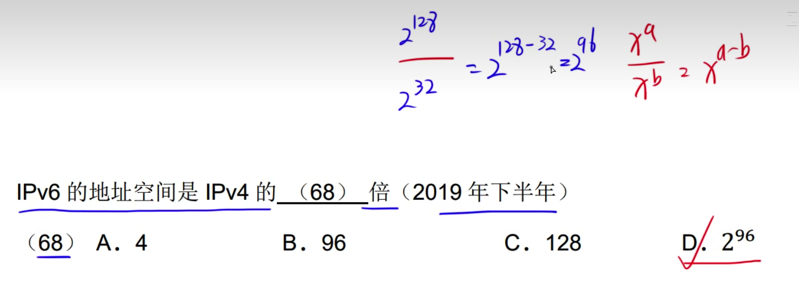
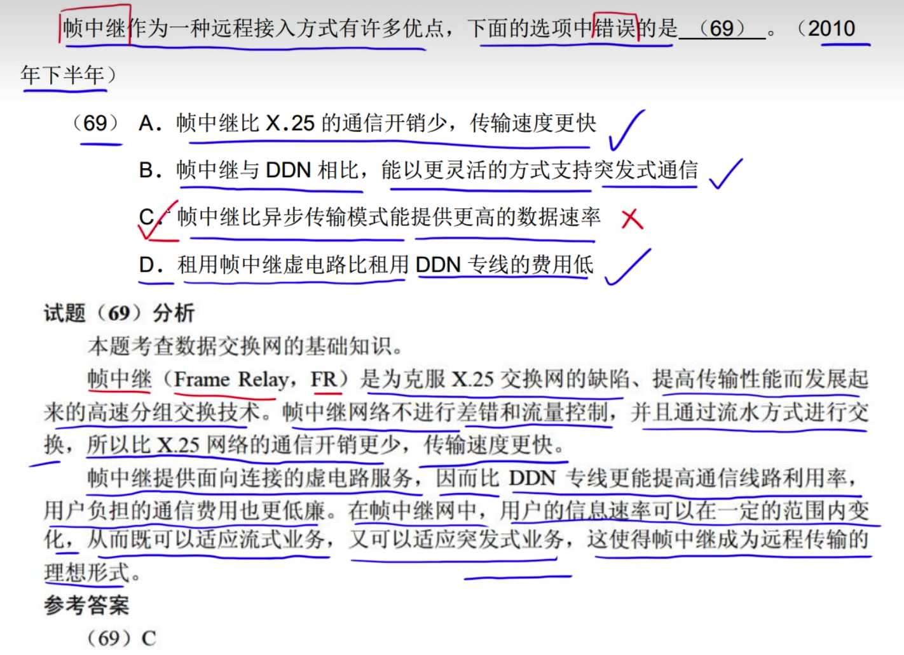
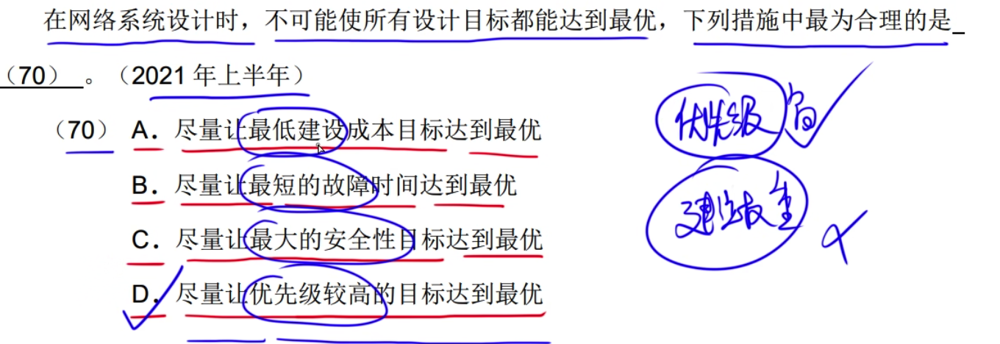

背: 哪些层有哪些协议

FTP20数据端口，21控制端口

URL

window命令

浏览器

网络设备    

# 网络设备

# 协议簇

---

---

---

---

---

---

---

# TCP和UDP

---

---

---

---

---

---

---

---

# SMTP和POM3

---

---

---

---

---

---

---

---

---

# ARP和RARP

---

---

---

# DHCP

---

---

---

D

---

# URL

---

A选项需要设置

---

---

---

---

---

---

# 浏览器

---

---

---

---

# IP地址和子网掩码

如B类网络地址 第一个字节表示范围:
10 000000 ~ 10 111111
即 128 ~ 191
255 - 64 = 191

---

网络地址: 网络号 + 子网号
默认子网号为0,0
255.255.0.0

现在变成了255.255.224.0

表示: 1110 0000 = 224
增加了3位
2^3 = 8

---

使用32位表示IP
26: 表示网络地址 6: 表示主机地址
由题目可知IP使用26个字节标识
使用16个字节表示
222用8位表示
125用8位表示
80用8位表示
128用2位表示

128
10 00 0000
后面6个字节表示主地址
因此2^6 = 64 减去全为0和全1的两个地址，最后结果为62

最小地址 10 00 0001 = 129
最大地址 11 11 1111 ,因为全1的需要减去 ，因此 11 11 1110  = 190

---

---

---

网络地址: 网络号 + 子网号
子网: 网络号(20) + 子网号(6)
主机: 占用 6 个字节

---

用20位表示子网掩码

答案CC

开始占用字节
192 = 110000000
11111111 11111111 110000000 000000000
11111111 11111111 1100(20位表示子网掩码)
转化为C类则是: 11111111 11111111 1100 1111 000000000
而C类的需要24位，因此还需要4位，增了2^4 = 16个

第三个部分表示的范围是: 
1100 0000 ~ 1100 1111
129 ~ 207

---

---

---

---

主机地址如果全是1则为广播地址，
主机地址如果全是0则为网络地址，

前三位不同:
24:00011000
33:00100001

---

C类地址的17~19位如果一致则匹配

---

# IPv6

---

---

---

# 无线网络

---

---

---

# window命令

---

---

---

---

---

---

---

---

---

# 路由

---

---

---

---

---

传输路由

---

# HTML

---

---

---

---

---

---

---

# Linux

---

---

---

# 杂题

---

---

---

---

---

---

---

---

---

---

---

---

---

---

---

