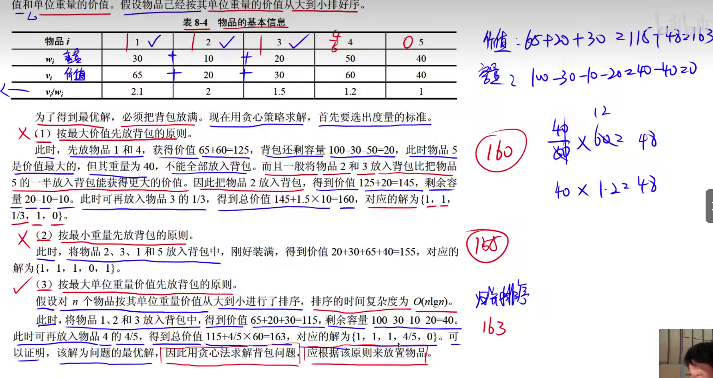

# 回溯法


深度优先

---


广度优先

---

# N皇后问题


任意两个皇后不处于以下情况:同列，同行，同一斜线(正斜线、反斜线)
假设Q1在(1,1)
那么Q2不能在(2,2)
假如Q1在(1,2)，Q2不能在(2,1)因为处于同一斜线上


---


---


# 分治法

## 归并排序

分解:

求解
合并

从两个子序列开头进行比较归并

## 最大子段和

非空连续子串之和


例如:

最大子段和 = 20

最大子段和时间复杂度:


---


---


---


---


# 动态规划法


动态规划法的子问题存在不独立，也就是相同的子问题
分治法的子问题是独立的


# 0-1背包问题


i: 第几个物品
j: 背包容量


```
W[i]: 第i个物品的重量
f[i][j]: 可选1~i的产品，并且背包容量是j时，能够拥有的最大价值
如i = 2 j = 3
背包容量是3，在物品1,2之间选择物品所有拥有的最大价值，不能重复选择物品

```

时间复杂度:


---


---


---


---


---


---


---

# 贪心法




---


---


因为是贪心，总会选择当前最优解
因此价值选择依次累计即可

---


---


```
i=1 1
i=2 2
i=3 3
i=4 4
i=5 5
=15
```


---


---


---


---


---


---


---

