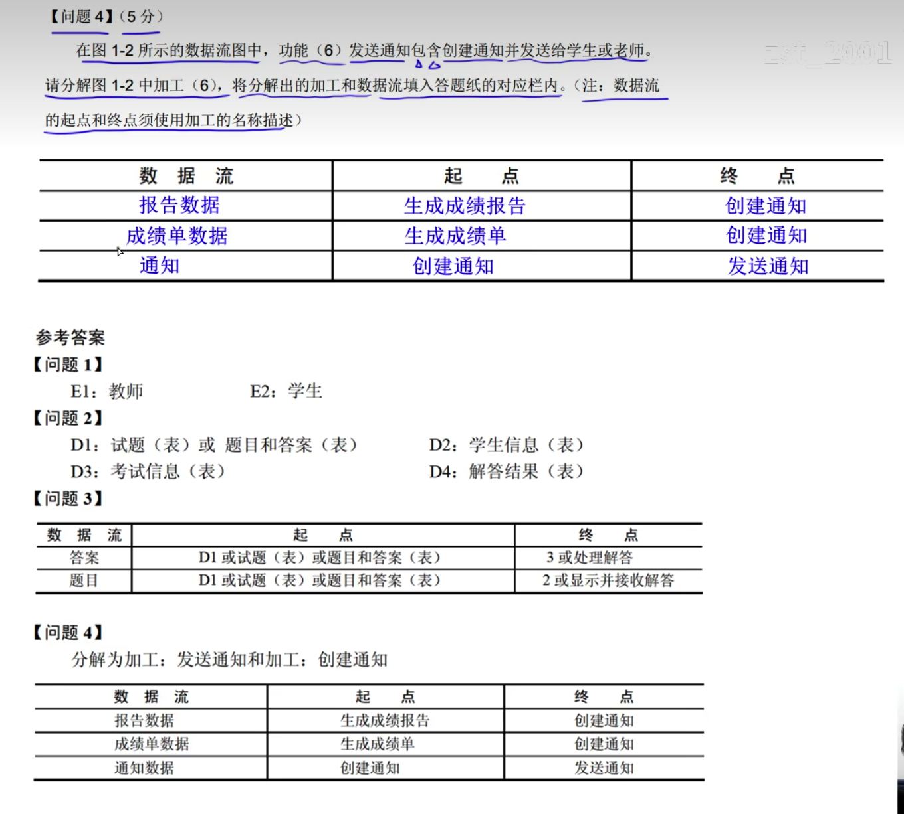
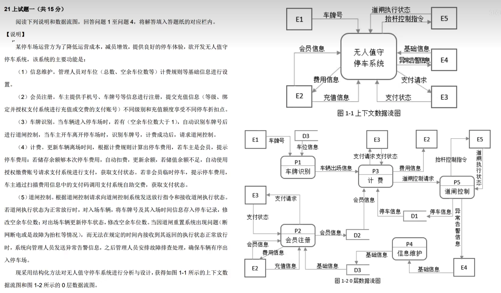

# 问题三技巧

## 父图子图平衡

一、父图中的数据流名称一定在子图中出现

父图中的实体输入输出都能在子图中找到。

## 一个加工至少有一个输入流和输出流

## 数据守恒

根据加工说明描述，找到对应的子图，如果子图中找不到说明中的描述，则缺少流程

填写问题三时，需要把实体，数据存储的名称标记好在图中，并且使用不同的线标记实体和数据，方便根据说明找到确实的数据流。

留意根据，更新，修改，删除，查询，依据，进行，控制，把

# 问题三

# 问题四

---

问题一:

E1: 传感器

E2: 农业专家

E3: 农业人员

E4: 控制器

问题二:

D1: 监控处理规则表

D2: 检测信息表

D3: 分析结果表

D4: 预测信息表

问题三:

数据流							起点								终点

历史检测信息				D2									P3

监控处理规则				D1									P4

请求监测信息				E2									 P5

分析结果						P3									P5

预测信息						P3									P5

问题四:

可分为实时监测分析、历史监测分析

分解时需要注意每个子加工至少有一个输入流和输出流

数据流的起点和终点至少有一个是加工

问题四参考答案:

---

---

---

---

E1:客户 E2: 经纪人E3: 财务人员E4: 外部网站

D1: 客户信息表D2:潜在房源表 D3:房源信息表 D4：订单表

数据流名称							地点							终点

交易反馈								P4								E2

添加出售/出租房源的客户	P1								D1

客户需求情况						D1								P3

客户信息包括：身份证号，姓名，手机号，需求情况，委托方时

房源信息包括:基本情况，配套设施，交易类行，委托方时，业主

