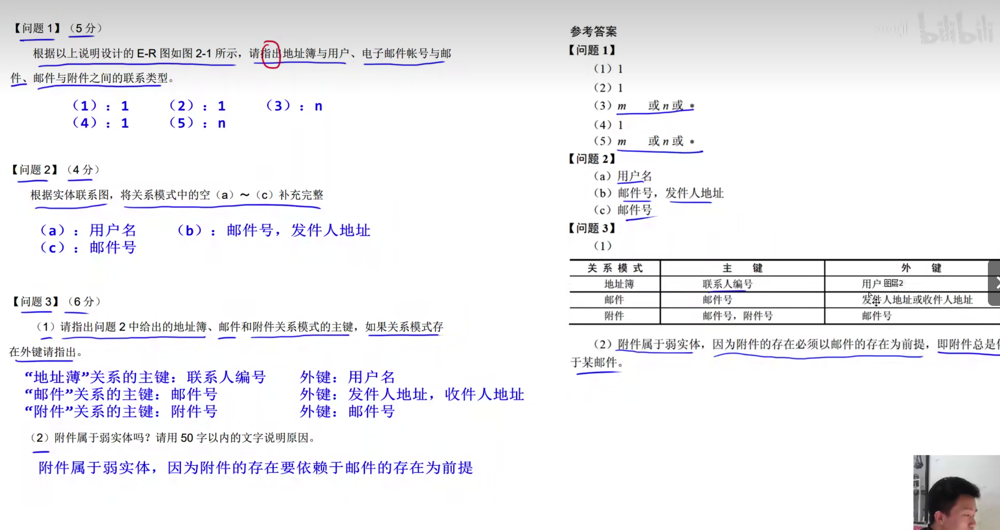
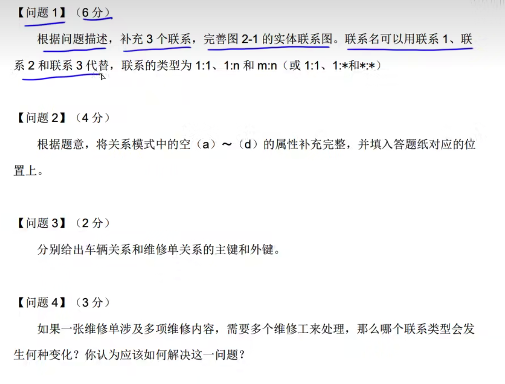
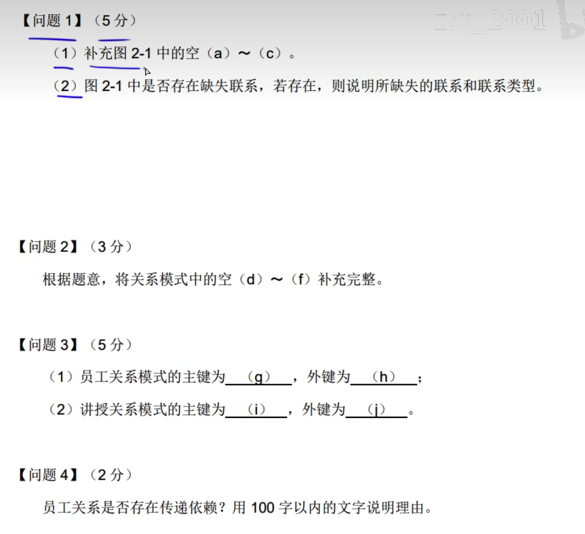

# 基本

完整性约束就是补充主键和外键

属性下面有下划线: 就是主键

# 问题一

# 问题二

元组: 一条数据

### 一对一

### 一对多

### 多对多

### 多对多对多

### 子实体和父实体

技巧:

说明中描述的实体缺少字段时则直接填写
关系中缺少的也有可能是关联表的主键(根据一对多的关系，如果关系是多，那么应该填写1的表的主键)
如果所属关系单独出现一个关系，就不能再填写主键，如托运申请表，只能填写申请号,客户号，因为下面有单独的安排承运关系，该关系包含了业务员即员工号

---

---

问题二:

注意还有外键，一个空有可能有多个字段

有说明可知，一张维修单可有多个维修工，而维修工是个实体，因为部门表中的主管也是实体，因此这里就写（车牌号，维修工）

问题三:

问题四:

1:* 变成了`*:*`

把维修工删除，新增一个维修关系，

维修(维修单号,维修工,维修内容,工时)

---

问题一:

分公司-经理: 1:1

分公司-业务部: 1:*

业务部-主管: 1:1

业务部-职员: 1:*

答案：

问题二:

a: 经理号

b: 地址，分公司编号，主管

c: 所属业务部编号

答案:

问题三:

"分公司"关系的主键: 分公司编号 外键: 经理号

"业务部门"关系的主键: 业务部编号 外键: 分公司编号，主管

答案:

问题四:

"职员"关系就会存在冗余，冗余了家庭成员姓名和成员关系

新增一个家属关系

家属(家属编号，职员号，家庭成员姓名，成员关系)

家属为主键，职员号为外键

答案:

---

问题一:

a:负责人

b:培训师

c:新入职员工

所属 员工-部门:*:1 

授课 培训师-新入职员工：`*:*`

答案:

因为表中有部门负责人，因此是部门负责人而不是负责人

说明中没有体现培训师和新入职员工的关系，因此不需要填写

问题二:

d:岗位，基本工资

e:课程号

f:培训师，员工号

答案:

根据实体名称判断是否要写工号编号等，如其他表中存在培训师，因此这些需要改成新入职员工

问题三:

(员工号) (部门号)

(课程号，培训师)（培训地点）

答案:

联合主键使用括号括起来，外键是表的主键

问题四:

存在

员工号->岗位 岗位->基本工资

因此员工号->基本工资

答案:

---

---

不需要增信一个实体，

员工号，任职时间，任职年限

