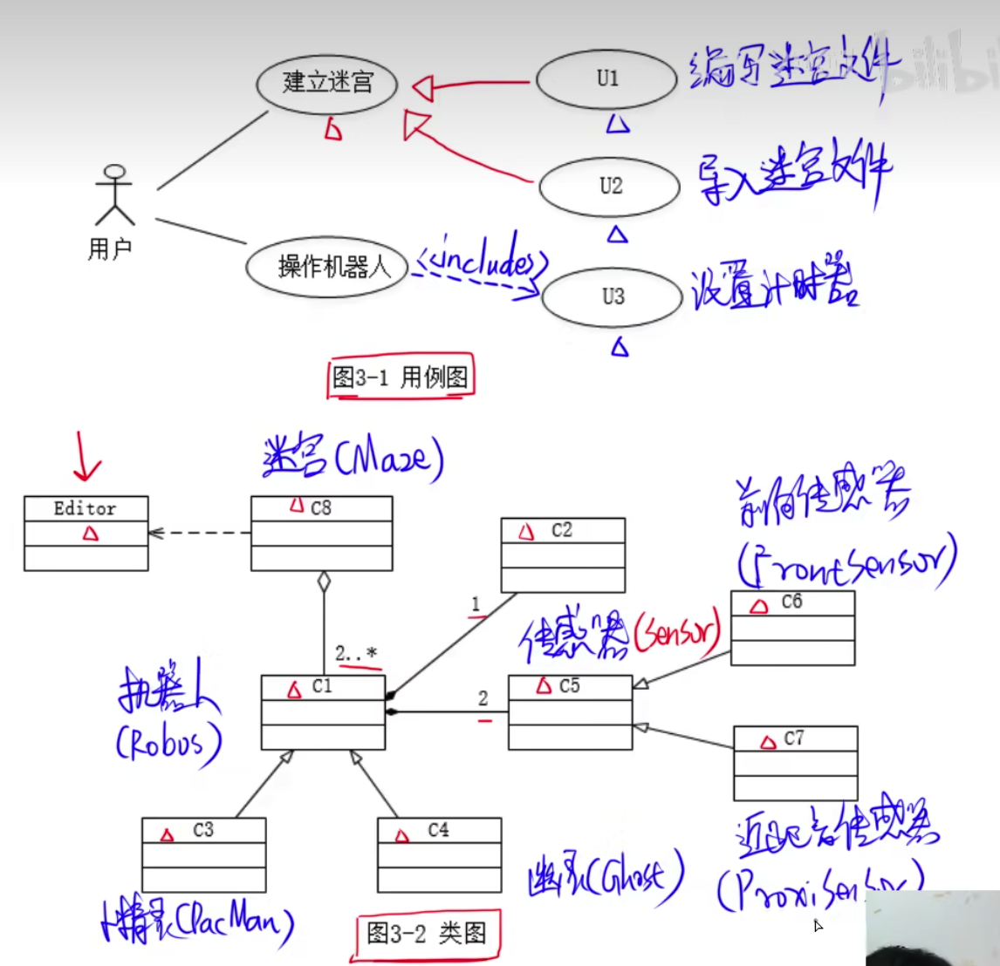
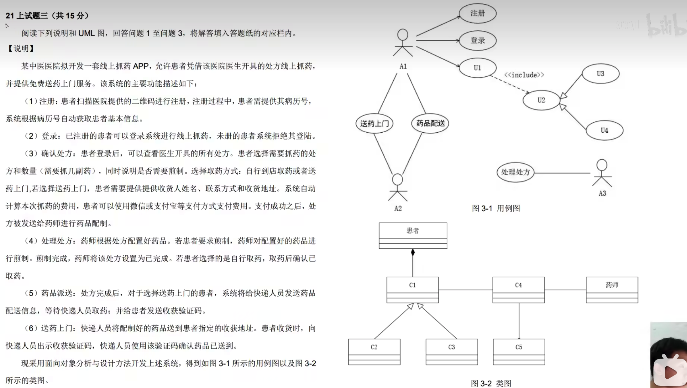
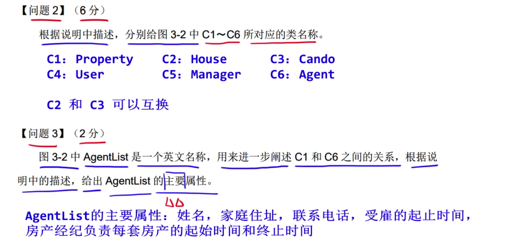

# 基本

extend：扩展指向基用例 include：包含指向子用例

# 问题一

根据include和extend关系确定

# 问题三

根据依赖关系，泛化关系，和组合聚合关系确定

# 题目

---

问题一:

A1: 患者

A2: 快递人员

A3: 药师

U1: 确认处方

U2: 取药

U3: 自行到店

U4: 送药上门

问题二:

C1: 支付

C2: 支付宝

C3: 微信

C4: 处方

C5: 煎制

问题三:

患者确认处方时需要选择取药方式，因此确认处方用例包含了取药用例，两者是包含关系。

取药用例根据方式不同可以分为自行到店取药用例和送药上门用例，之间关系为泛化关系。

药师处理处方时，根据患者需求确定是否需要煎制药物，因此处理处方可以扩展煎制用例

答案:

处方和药品之间只有单项关系

问题一技巧:

参与人是用户，因此用户可作出的动作就是U1的范围，如果选择送药上门用例，图的左边已经包含了，所以需要选择支付用例

---

# 真题

问题一:

C1:付款

C2:处方

C3:信用卡

C4:支付宝

C5:电子邮件

1:1 

2：* 

3:   1

4：1

5：* 

6：*

答案:

问题二:

S1:审核中

S2 无效处方

S3 医生信息无效

S4 无法审核

7 核实医生信息

8 处方确认请求

9 系统取消处方

10 处方无效

答案:

迁移名应该填写，导致下一个状态的原因

问题三：

聚合关系和组合关系

聚合关系，子类的生命周期不依赖于主体，

组合关系，子类和主体的生命周期一致，

答案：

总答案:

---

问题一：

A1:房产经纪

A2:系统管理员

U1：审批授权

U2:修改房产信息

U3:删除房产信息

a: extends 扩展关系

b: include 包含关系

答案：

问题二：

C1:Property

C2:House

C3:Cando

C4:User

C5:Manager

C6:Agent

答案

问题三

AgentList: 姓名，家庭住址，联系电话，受雇起始时间，房产证明，负责房产起始时间，负责房产终止时间

答案

---

问题一：

A1:接待员

A2:医护人员

A3:办公人员

U1:Maintain patient info

U2:Record office  visit info

U3:print invoice

答案：

问题二：

C1:patientinvoice

C2:insturanceinvoice

C3:invoice

C4: procedure

C5:officevisit

答案：

问题三：

治疗项目名称，医护人员身份证号

病人身份证号，就诊时间

身份证号

身份证号

答案：

---

问题一:

A1: buyer

A2:warehouseman

A3:dispature

U1:register detail

U2: print order

U3：buy books

问题二：

U3:

事件流，所有备选事件流

浏览书籍信息，选择所需购买的书籍好额数量，输入注册码

问题三：

C1：注册信息 C2: OrderC3:书籍信息

---

