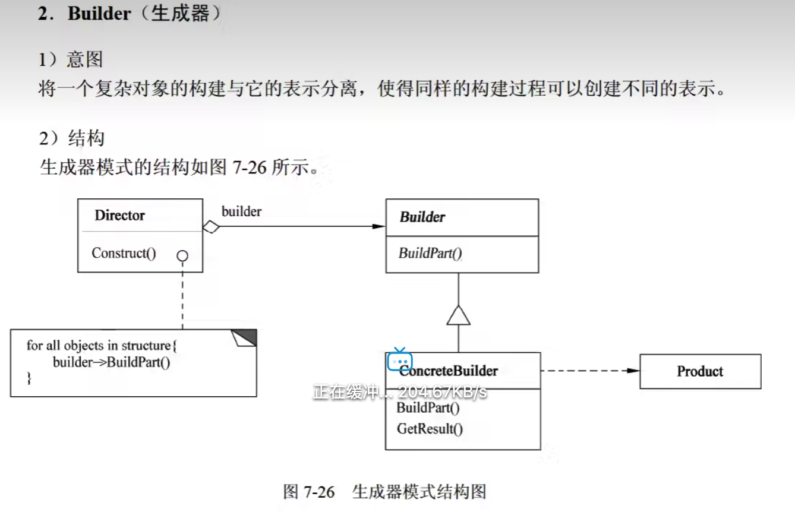
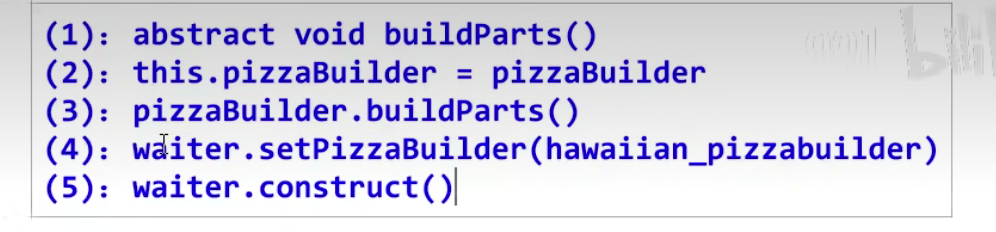
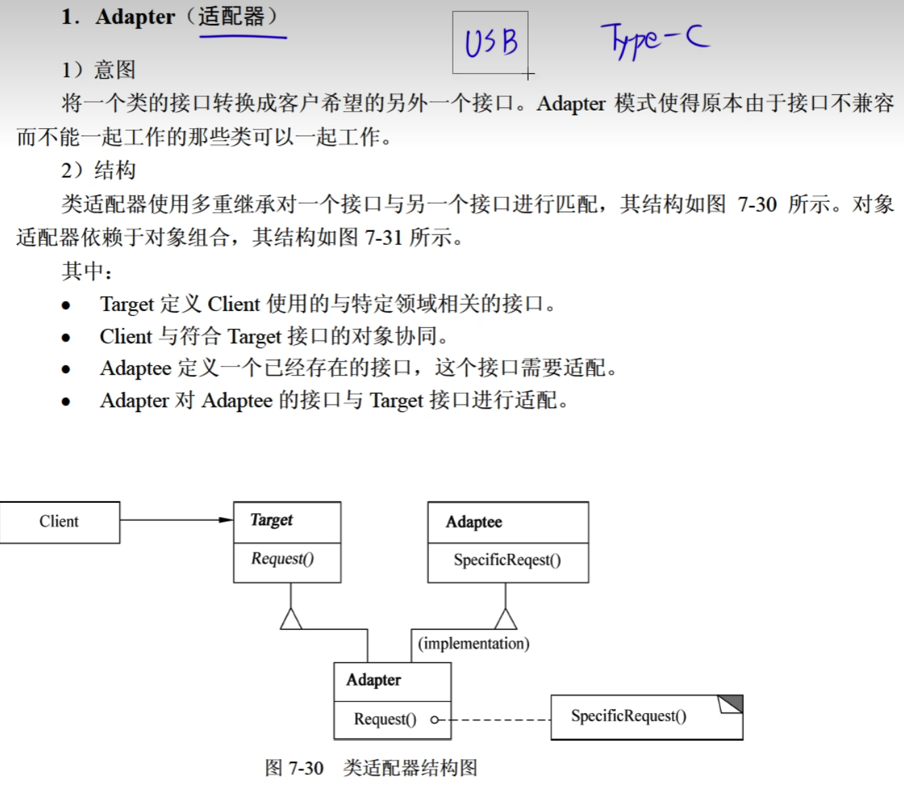
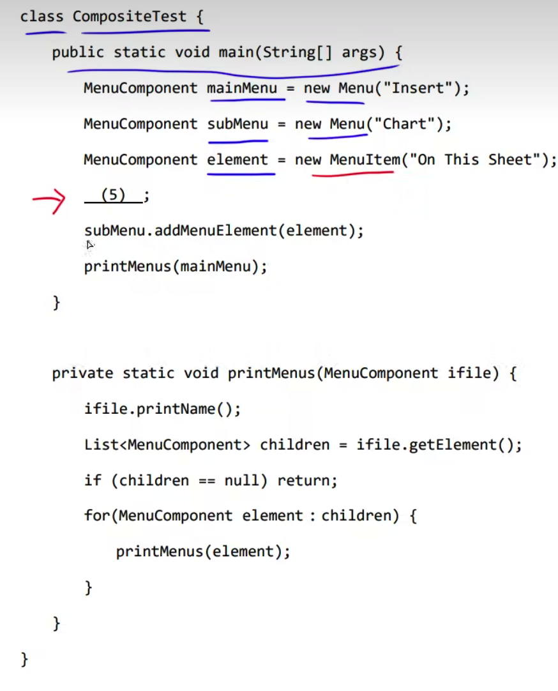
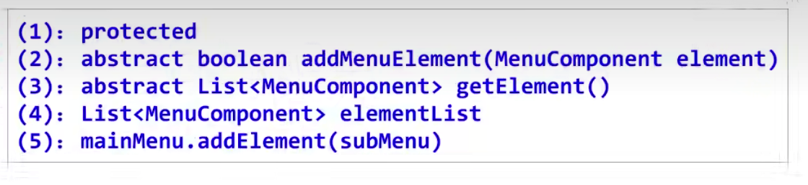
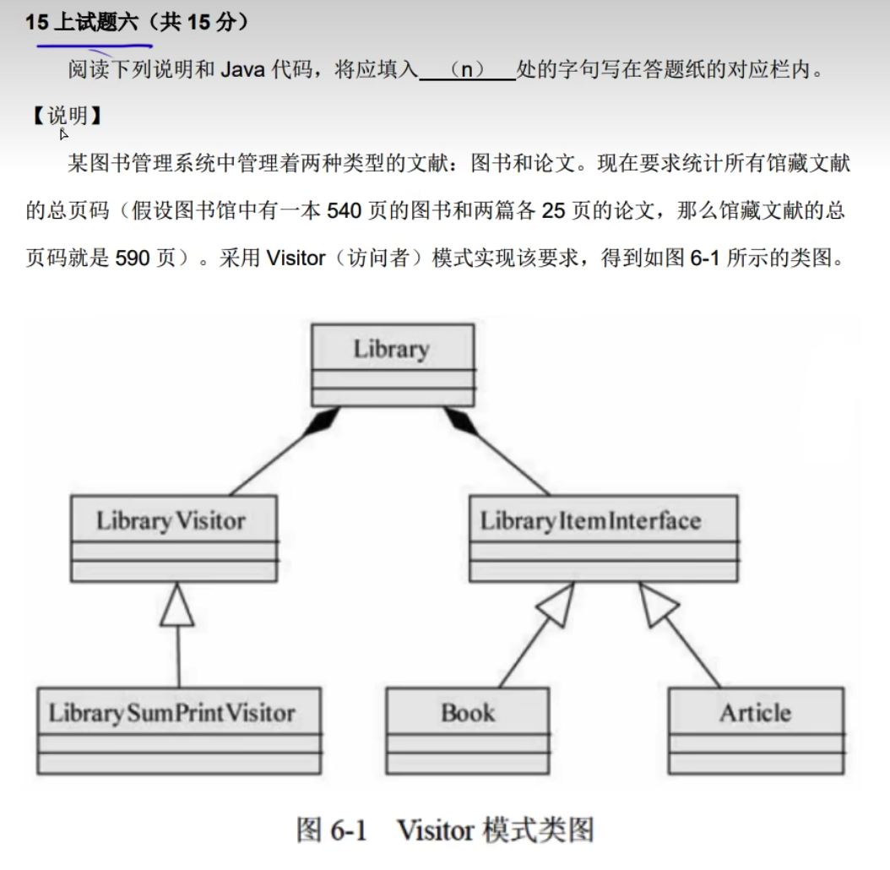
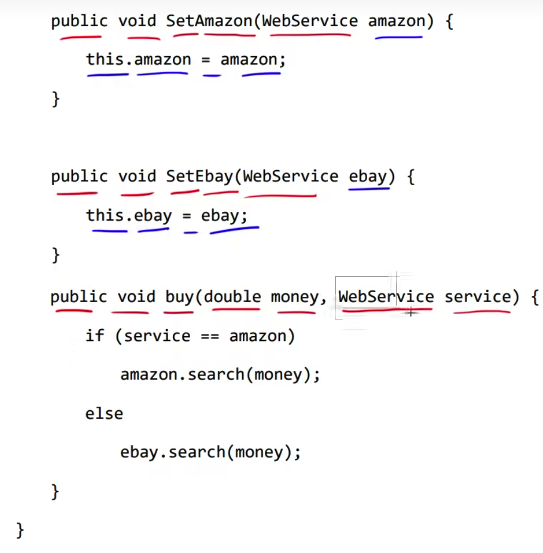

# 1抽象工厂模式


## 题目


# 2生成器模式




```
(1)void buildParts()
(2)this.pizzaBuilder = pizzaBuilder
(3)pizzBuilder.buildParts()
(4)waiter.setPizzaBuilder(hawaiian_pizzabuilder)
(5)waiter.construct()
```
第一个空因为有public并且是抽象方法，因此需要补全abstract关键字
abstract void buildParts()

答案:



为什么需要添加this: 因为当前类中有同名的变量，入参名和当前类中的成员变量名称相同，就需要指定this

---


```
(1)Product getResult()
(2)void builderPartA()
(3)product.setPartA
(4)product.setPartB
(5)builder.builderPartB()
```


# 3原型模式


## 题目


```
有错误答案:
(1)implements
(2)WorkExprience obj = new WorkExprience()
(3)implements
(4)work
(5)new Resume("姓名")

克隆对象中使用其他对象进行克隆
```

官网答案:


# 4适配器模式



## 题目


```
(1)Address address
(2)this.address.streeet()
(3)this.address.zip()
(4)this.address.city()
(5)DutchAddress addrAdapter = new DutchAddressAdaper(addr)
```

答案:


# 5桥接模式


## 题目


```
(1)this.imp
(2)ImageImp
(3)imp.doPaint(m)
(4)new BMP()
(5)new WinImp()
(6)image1.setImp(imageImp1)
```


---


```
(1)public abstract class
(2)public abstract void drawLine(double x1, double y1, doube x2, double y2)
(3)public abstract void drawCircle(double x, double y, double r)
(4)draw_a_cricle(x, y, r)
(5)drawcricle(x,y,r)
(6)public abstract void draw()
```


答案:


```
接口的默认书写 void t()
如果该接口其他的方法有修饰符，则保持一致
抽象类中如果有修饰符则保持一致，如public abstract void test();
```

# 6组合模式


## 题目





```
(1)protected
(2)abstract boolean addMenuElement(MenuComponent element)
(3)abstract List<MenuComponent> getElement()
(4)String name
(5)mainMenu.addMenuElement(subMenu)
```

第四个空时，需要注意父类是否已经有成员变量


答案:


# 7装饰器模式


## 题目


```
(1)ticket.printInvoice()
(2)this.printInvoice()
(3)super.ticket.printInvoice()
(4)new HeadDecorator(t)
(5)new FootDecorator()
```

参考答案:


# 8享元模式


## 题目


```
(1)public abstract void draw()
(2)Piece
(3)Piece
(4)piece.draw()
(5)piece.draw()
```


# 9命令模式


## 题目


```
(1)interface Command
(2)super.on()
(3)super.off()
(4)onCommands[slot - 1]
(5)offCommands[slot - 1]
(6)onCommands[slot-1].execute()
(7)offCommands[slot-1].execute()
```

答案:


需要注意第二和第三个空，如果当前实体中有父类，则不需要使用super

# 10观察者模式


## 题目


·

```
(1)void update()
(2)Observer
(3)obs.update()
(4)Subject
(5)Attach(this)
```

答案:


# 11状态模式


## 题目


```
(1)abstract double travel(int miles, CFrequentFlyer context)
(2)context.setState(new CSilver())
(3)context.setState(new CGold())
(4)context.setState(new CSilver())
(5)context.setState(new CBasic())
```

答案:


# 12策略模式


## 题目


```
(1)void stop()
(2)BrakeBehavior
(3)wheel.stop()
(4)super.wheel = behavior
(5)break()
```


答案:


```
什么时候用this: 因为当前类中或者父类中有同名的变量，入参名和当前类中的成员变量名称相同，就需要指定this
什么时候用super: 方法只在类中出现时，不需要super.method()，如果method在当前方法中也出现了，就需要指定调哪个方法
```

# 13访问者模式


# 题目




```
(1)void visit(Book p_book)
(2)void visit(Article p_article)
(3)void accept(LibraryVisitor visitor)
(4)visitor.printSum()
(5)visitor.printSum()
```

答案:


# 14中介者模式


## 题目





```
(1)void buy(double money, WebService service)
(2)WebServiceMediator
(3)abstract void buyService(double money)
(4)mediator.buy(money, this)
(5)mediator.buy(money, this)
```

答案:


# 总结


