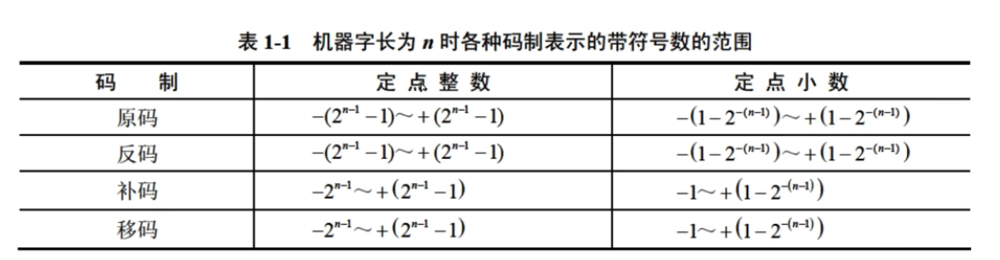

---

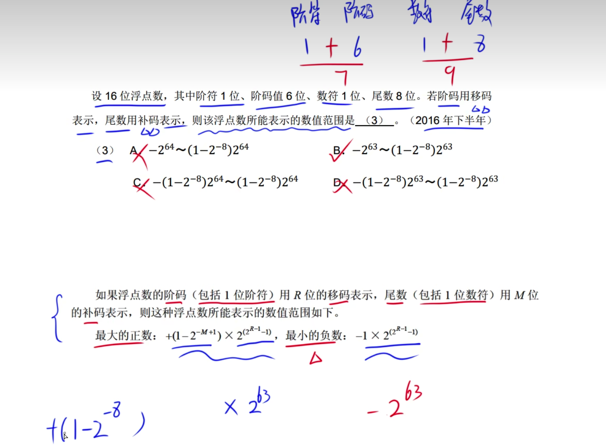

---

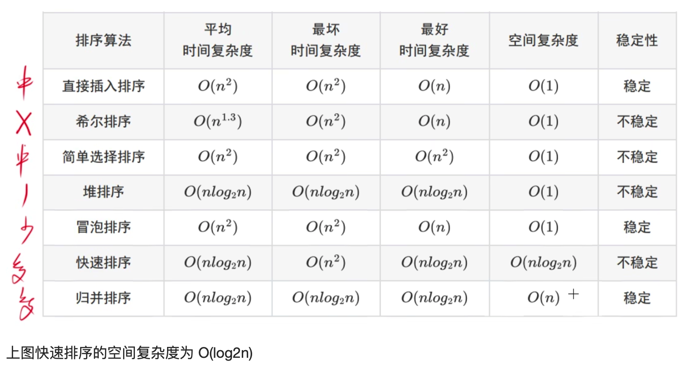	

---

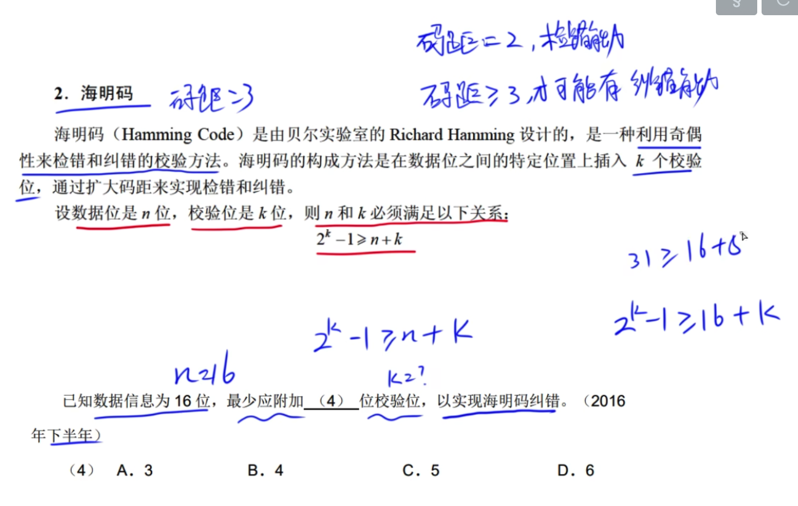

---

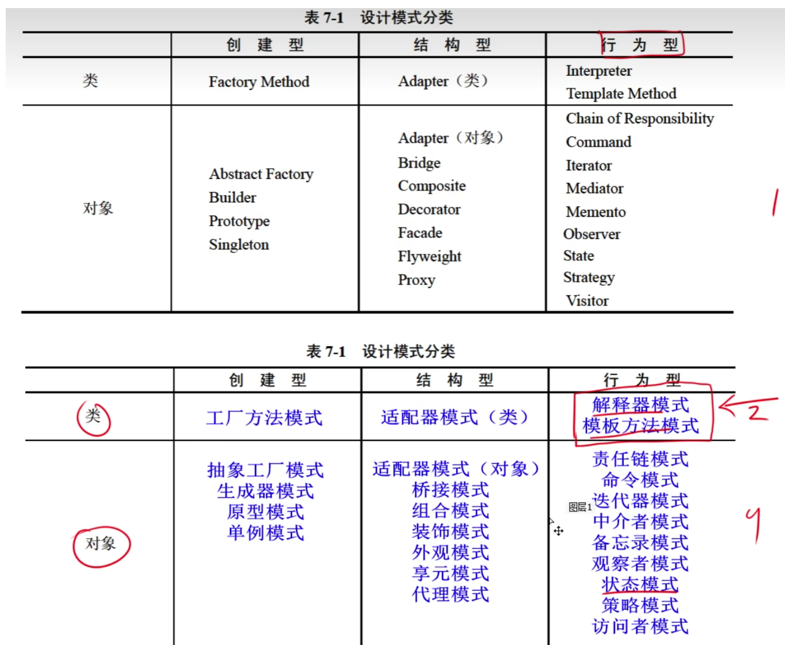

---

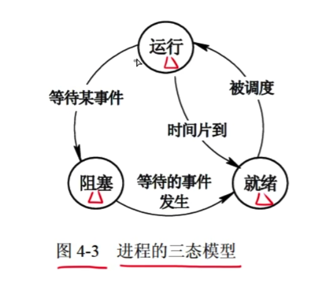

---

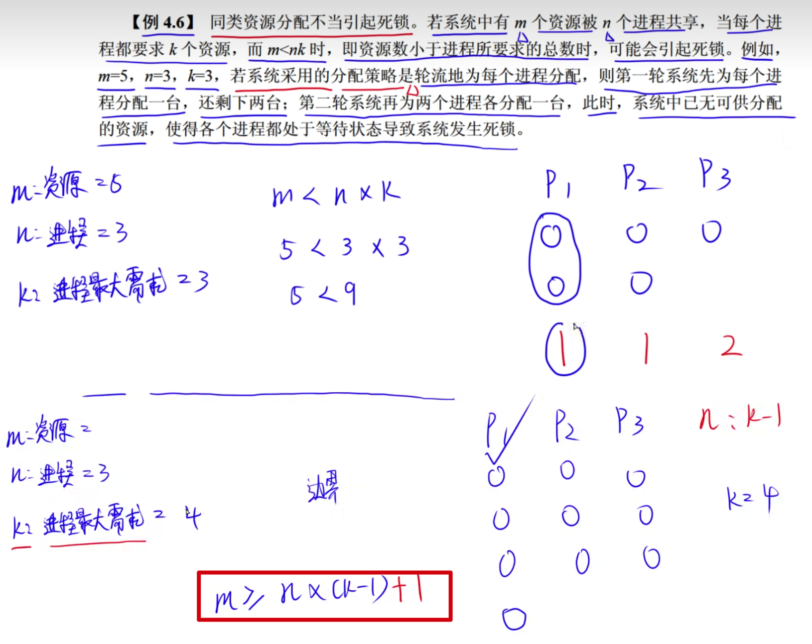

满足不死锁的条件

R: 总资源数
P: 进程数
N: 进程最大需要的资源数

R >= P * (N-1) + 1

---

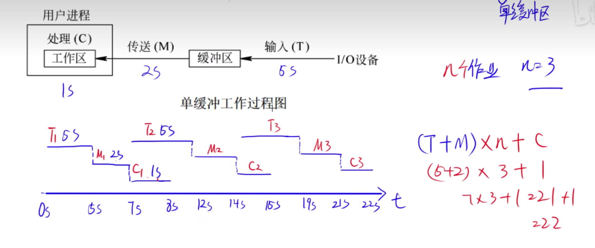

---

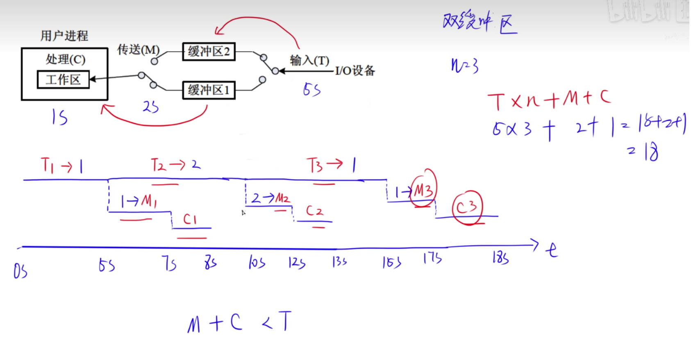

---

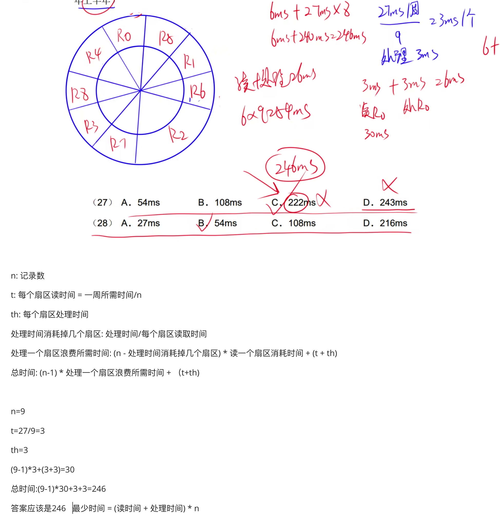

---

螺旋 成本大 抗风险
瀑布 快速产品 需求要清晰 老的项目
增量 快速产品 不易拆解小需求 需求要清晰
原型 不适合大项目 捕获需求
喷泉 阶段无界限 以用户需求为动力 是面向对象的
水晶开发 具有不同的策略
极限 要交付
极限 没有精心设计 不编写测试代码

---

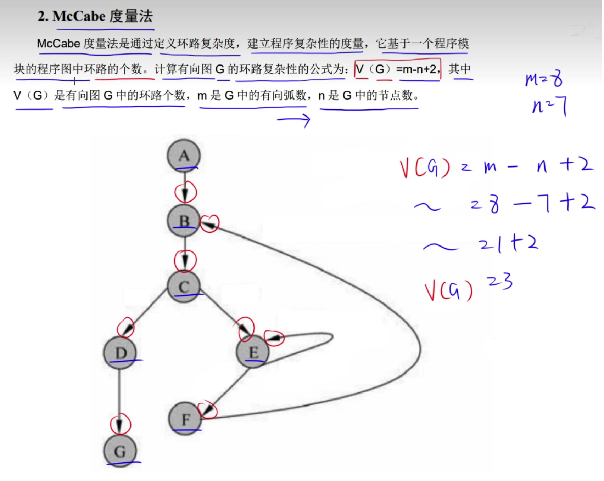

---

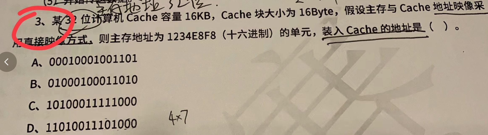

16KB/16 = 16 * 1024 B / 16 B = 1024块

---

判断覆盖: 每个条件满足真假即可

路径覆盖: 每个条件所有真假组合，A  B 两个条件   tt tf ft ff

语句覆盖: 走到执行语句的条件